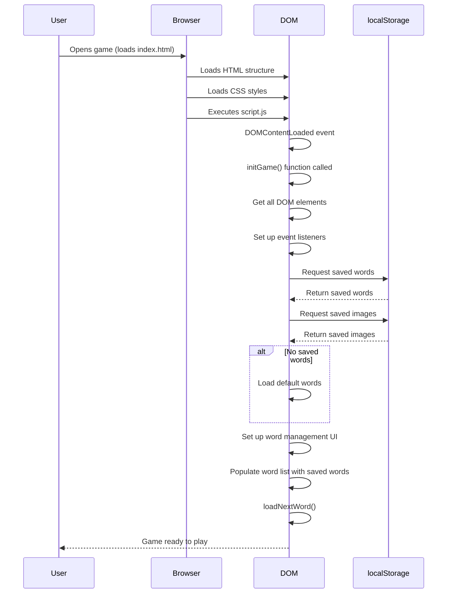
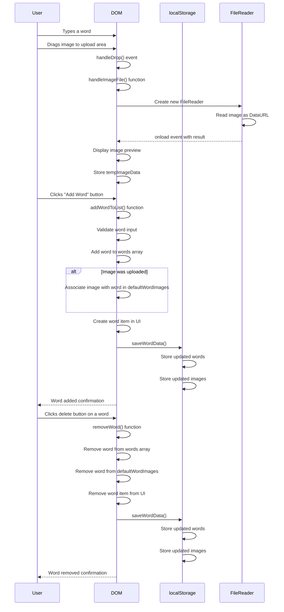
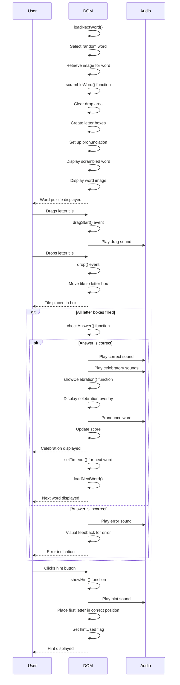
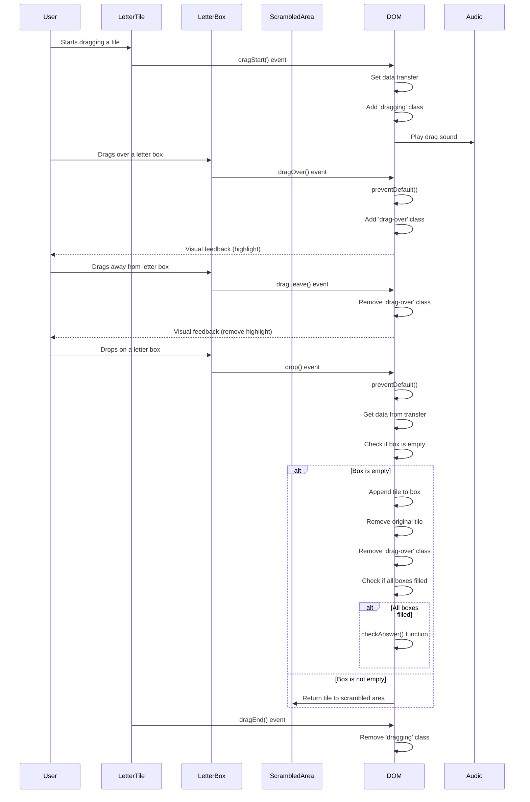
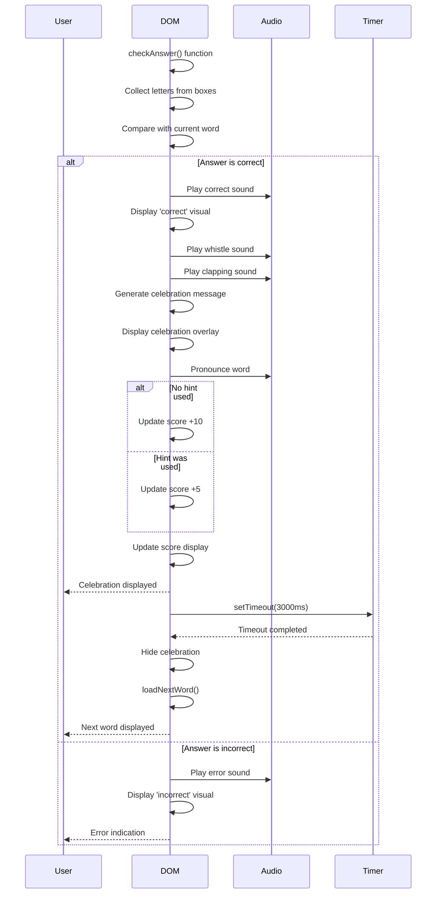
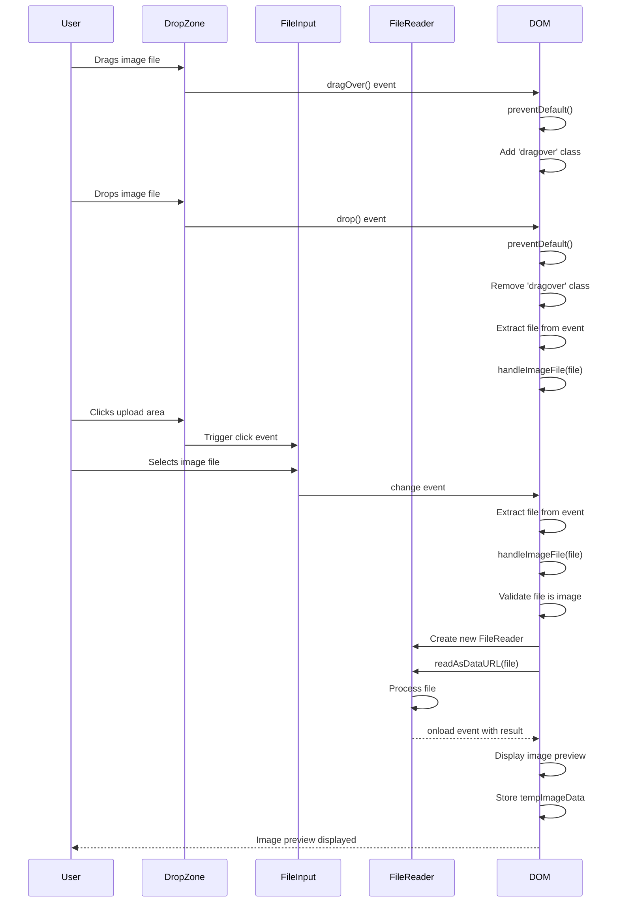

# English Vocabulary Learning Game - Technical Documentation

## Table of Contents
1. [Architecture Overview](#architecture-overview)
2. [File Structure](#file-structure)
3. [Core Data Structures](#core-data-structures)
4. [Game Initialization](#game-initialization)
5. [Word Management System](#word-management-system)
6. [Game Logic and Flow](#game-logic-and-flow)
7. [Drag and Drop System](#drag-and-drop-system)
8. [Audio Management](#audio-management)
9. [Celebration Effects](#celebration-effects)
10. [Styling and Animations](#styling-and-animations)
11. [Extension Points](#extension-points)
12. [Sequence Diagrams](#sequence-diagrams)

## Architecture Overview

The English Vocabulary Learning Game is built as a client-side web application using pure HTML, CSS, and JavaScript (no frameworks). It follows a modular architecture with clearly separated concerns:

- **HTML (index.html)**: Defines the structure and elements of the game
- **CSS (style.css)**: Handles all styling, animations, and visual effects
- **JavaScript (script.js)**: Contains all game logic, event handling, and state management

The application uses the browser's localStorage API to persist game data between sessions, allowing the game to remember custom words and images. It also leverages the HTML5 Drag and Drop API for the core gameplay mechanics.

## File Structure

```
english-vocabulary-game/
├── index.html          # Main HTML structure
├── script.js           # Game logic and functionality
├── style.css           # Styling and animations
└── README.md           # User documentation
```

## Core Data Structures

### Global Variables

```javascript
// Words and Images
let words = [];                     // Array of all available words
let defaultWordImages = {};         // Dictionary mapping words to their image URLs
let tempImageData = null;           // Temporary storage for image data during upload

// Game State
let currentWord = '';               // Current word being played
let scrambledWord = '';             // Scrambled version of current word
let currentImageUrl = '';           // Image URL for current word
let score = 0;                      // Player's score
let hintUsed = false;               // Flag to track if hint was used for current word
```

### DOM Elements

The game references numerous DOM elements stored in global variables for performance reasons, including:

- Game areas (word display, drop area, scrambled word, etc.)
- Audio elements for sound effects and pronunciation
- Buttons for game actions
- Word management interface elements

## Game Initialization

The game initialization flow occurs in the `initGame()` function:

1. **DOM Elements Acquisition**: All needed DOM elements are retrieved and stored in variables
2. **Audio Preloading**: Sound files are preloaded to ensure immediate playback
3. **Event Listeners Setup**: Event listeners for buttons and drag-drop functionality are attached
4. **Word Management Setup**: Word list interface is initialized with event handlers
5. **Data Loading**: Saved word and image data is loaded from localStorage
6. **UI Preparation**: Word list UI is populated with saved data
7. **Game Start**: The first word is loaded to begin gameplay

## Word Management System

The word management system allows users to customize the game with their own words and images:

### Data Storage

- Words are stored as an array in localStorage under the key `'gameWords'`
- Word images are stored as a JSON object mapping words to dataURLs under `'gameWordImages'`

### Image Upload Flow

1. User clicks or drags an image onto the upload area
2. The `handleImageFile()` function converts the image to a dataURL using FileReader
3. Image preview is displayed and the dataURL is stored in `tempImageData`
4. When adding a word, the image data is associated with the word in `defaultWordImages`

### Word Addition Flow

1. User enters a word and optionally uploads an image
2. The `addWordToList()` function validates the input
3. Word is added to the `words` array
4. If an image was uploaded, it's associated with the word in `defaultWordImages`
5. A visual representation of the word (with image if present) is added to the word list UI
6. Data is saved to localStorage via `saveWordData()`

### Word Removal Flow

1. User clicks the delete button on a word
2. The `removeWord()` function removes the word from the DOM
3. Word is removed from the `words` array
4. Any associated image is removed from `defaultWordImages`
5. Updated data is saved to localStorage

### Data Persistence

The `saveWordData()` and `loadWordData()` functions handle saving and loading the word and image data using localStorage:

```javascript
// Save word data to localStorage
function saveWordData() {
    localStorage.setItem('gameWords', JSON.stringify(words));
    localStorage.setItem('gameWordImages', JSON.stringify(defaultWordImages));
}

// Load word data from localStorage
function loadWordData() {
    const savedWords = localStorage.getItem('gameWords');
    const savedImages = localStorage.getItem('gameWordImages');
    
    if (savedWords) {
        words = JSON.parse(savedWords);
    } else {
        // Default words if none are saved
        words = ['apple', 'banana', ...];
    }
    
    if (savedImages) {
        defaultWordImages = JSON.parse(savedImages);
    }
}
```

## Game Logic and Flow

### Word Loading Flow

The game loads words through the `loadNextWord()` function:

1. Reset game state (clear hint used flag)
2. If no words remain, reset the word list
3. Choose a random word from available words
4. Remove selected word from list to prevent repetition
5. Get image URL (custom or generated Unsplash URL)
6. Scramble the word using Fisher-Yates shuffle algorithm
7. Reset drop area and create letter boxes based on word length
8. Set up pronunciation audio
9. Display scrambled word and image
10. Set up drop listeners for letter boxes

### Word Scrambling

The `scrambleWord()` function scrambles a word using the Fisher-Yates shuffle:

```javascript
function scrambleWord(word) {
    const wordArray = word.split('');
    
    // Fisher-Yates shuffle
    for (let i = wordArray.length - 1; i > 0; i--) {
        const j = Math.floor(Math.random() * (i + 1));
        [wordArray[i], wordArray[j]] = [wordArray[j], wordArray[i]];
    }
    
    let scrambled = wordArray.join('');
    if (scrambled === word && word.length > 1) {
        return scrambleWord(word); // Try again if it's the same as original
    }
    
    return scrambled;
}
```

### Answer Checking

The `checkAnswer()` function verifies if the user has correctly unscrambled the word:

1. Collect letters from all letter boxes
2. Compare user's answer with the current word
3. If correct:
   - Play success sounds (correct sound, whistle, clapping)
   - Show celebratory animation and random congratulatory message
   - Pronounce the word
   - Update score (full points if no hint was used, fewer points if hint was used)
   - Show visual feedback and load next word after delay
4. If incorrect:
   - Play error sound
   - Show visual feedback for incorrect answer

### Hint System

The `showHint()` function provides assistance:

1. Verify the drop area doesn't already have letters
2. Play hint sound
3. Set `hintUsed` flag (reduces points for the current word)
4. Find the first letter of the current word
5. Move it to the first letter box
6. Remove the original letter tile from the scrambled area

## Drag and Drop System

The game uses HTML5 Drag and Drop API for its core mechanics.

### Letter Tiles

Letter tiles are created with the `createLetterTile()` function:

```javascript
function createLetterTile(letter) {
    const tile = document.createElement('div');
    tile.className = 'letter-tile';
    tile.textContent = letter;
    tile.draggable = true;
    tile.id = 'tile-' + Date.now() + '-' + Math.random().toString(36).substr(2, 5);
    
    // Add drag event listeners
    tile.addEventListener('dragstart', dragStart);
    tile.addEventListener('dragend', dragEnd);
    
    return tile;
}
```

Each tile has a unique ID and event listeners for drag operations.

### Letter Boxes

Letter boxes are created in the `loadNextWord()` function:

```javascript
// Create placeholder boxes for each letter of the word
for (let i = 0; i < currentWord.length; i++) {
    const letterBox = document.createElement('div');
    letterBox.className = 'letter-box';
    letterBox.setAttribute('data-position', i);
    dropArea.appendChild(letterBox);
}
```

Letter boxes provide visual guidance for word length and letter placement.

### Drag Events

The drag and drop system uses these key event handlers:

- **dragStart**: Sets the data to be transferred and adds a visual class
- **dragEnd**: Removes the visual dragging class
- **dragOver**: Prevents default behavior to allow dropping
- **dragEnter/dragLeave**: Add/remove highlight classes for visual feedback
- **dropAreaDrop**: Handles dropping on the main drop area
- **dropOnScrambledArea**: Handles dropping back to the scrambled area

### Drop Logic

The drop system uses two approaches:

1. **Letter Box Drops**: Each letter box accepts drops directly
   - Only empty boxes accept drops
   - Letter tiles can be dragged between boxes
   - Letter tiles maintain draggability after being dropped

2. **Drop Area Drops**: For backward compatibility and usability
   - Finds the first empty letter box
   - Places the letter in that box

## Audio Management

The game incorporates several audio elements for a multi-sensory experience:

### Sound Types

1. **Gameplay Sounds**:
   - Correct answer sound
   - Wrong answer sound
   - Drag sound (plays when dragging letters)
   - Hint sound

2. **Celebration Sounds**:
   - Whistle (plays at start of celebration)
   - Clapping (plays during celebration)

3. **Pronunciation**:
   - Text-to-speech audio for each word

### Audio Implementation

Audio elements are declared in the HTML:

```html
<audio id="correct-sound" src="https://assets.mixkit.co/sfx/preview/mixkit-fairy-arcade-sparkle-866.mp3" preload="auto"></audio>
```

And played in JavaScript:

```javascript
// Example of playing sound with error handling
try {
    whistleSound.currentTime = 0;
    whistleSound.play().catch(e => console.error("Error playing whistle sound:", e));
} catch (error) {
    console.error("Error with whistle sound:", error);
}
```

### Text-to-Speech Integration

The game uses Google's Text-to-Speech API for word pronunciation:

```javascript
function setPronunciation(word) {
    const ttsUrl = `https://translate.google.com/translate_tts?ie=UTF-8&client=tw-ob&tl=en&q=${encodeURIComponent(word)}`;
    pronunciationAudio.src = ttsUrl;
    pronunciationAudio.load();
}
```

## Celebration Effects

When a player successfully solves a word, the game provides celebratory feedback:

### Visual Elements

The celebration overlay includes:
- Animated fireworks
- Floating balloons
- Falling confetti
- Random congratulatory messages

### Implementation

The celebration is triggered in the `checkAnswer()` function:

1. Random selection of celebratory heading and message
2. Display of the celebration overlay
3. Sequential playing of sound effects
4. Word pronunciation
5. Automatic hiding of celebration after a delay

## Styling and Animations

The game's visuals are defined in `style.css` and include:

### Core Game Elements

- Responsive layout with flexbox
- Kid-friendly color scheme and large fonts
- Clear visual distinction between game areas

### Letter System

- Draggable letter tiles with visual feedback
- Letter boxes with dashed borders for visual guidance
- Hover and drag-over effects for interactive feedback

### Animations

- Firework bursts during celebration
- Floating balloons with varied speeds
- Falling confetti with different colors and delays
- Text animations for congratulatory messages

### Responsive Design

- Mobile-friendly layout adjustments
- Touch-compatible interactions
- Flexible container sizing

## Extension Points

The game is designed with several extension points for future enhancements:

### New Features

1. **Difficulty Levels**: Implement by creating word categories or adjusting scrambling algorithms
2. **Multiplayer**: Add support for multiple players with score tracking
3. **Timed Mode**: Implement time limits for solving words
4. **Categories**: Group words by themes or subjects
5. **Achievements**: Add achievement system for milestones

### Code Modification Points

1. **Word Selection**: Modify `loadNextWord()` to implement custom word selection logic
2. **Scoring System**: Adjust the score calculation in `checkAnswer()`
3. **UI Themes**: Add theme options by extending the CSS
4. **Additional Game Modes**: Create new game modes by extending the core mechanics

### API Integration

The game already integrates with:
- Google Text-to-Speech API for pronunciation
- (Optional) Unsplash for default images

Additional potential integrations:
- Dictionary APIs for word definitions
- Language learning APIs for translations
- User account systems for progress tracking

## Sequence Diagrams

This section provides sequence diagrams that visualize the key flows and interactions within the application.

### Game Initialization Flow



### Word Management Flow



### Gameplay Flow



### Drag and Drop Interaction Flow



### Answer Checking Flow



### Image Upload Flow



These sequence diagrams provide visual representations of the key processes in the application, making it easier to understand the flow of operations and interactions between different components.

## Conclusion

This technical documentation provides a comprehensive overview of the English Vocabulary Learning Game's architecture, code structure, and logic flows. It should serve as a reference for maintaining and extending the application in the future.
