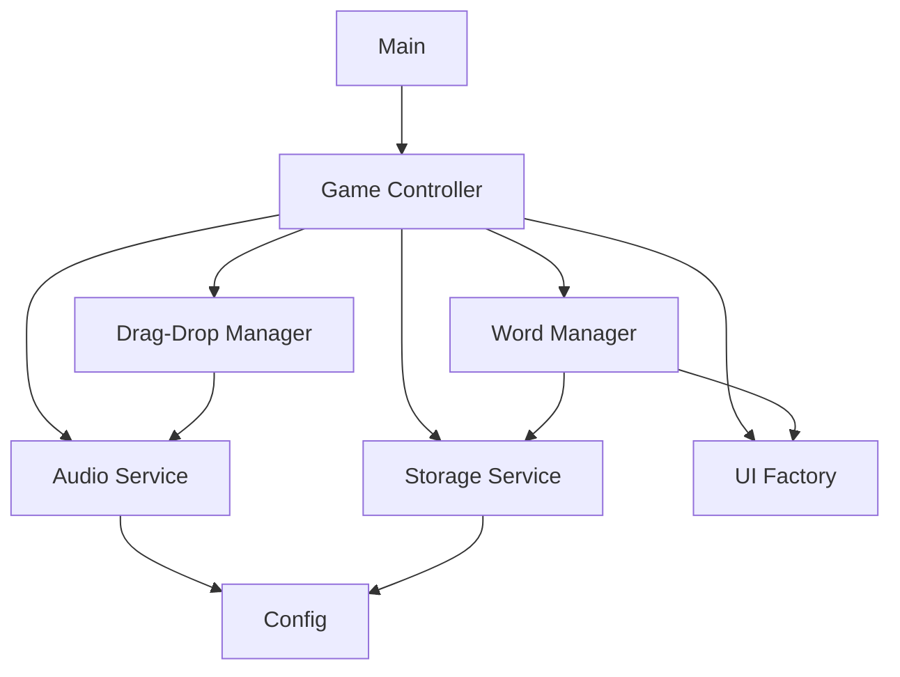

# Architecture Overview

The Word Scramble Game uses a modular architecture following SOLID principles and design patterns. Each module has a specific responsibility and communicates with other modules through well-defined interfaces.

## Module Structure

The game's codebase is organized into the following modules:

1. **Config Module** (`config.js`): Central configuration hub
2. **Storage Module** (`storage.js`): Data persistence layer
3. **Audio Module** (`audio.js`): Sound management
4. **UI Factory** (`ui-factory.js`): UI element creation
5. **Word Manager** (`word-manager.js`): Word list management
6. **Drag-Drop Manager** (`drag-drop.js`): Drag and drop functionality
7. **Game Controller** (`game-controller.js`): Core game logic
8. **Main** (`main.js`): Application entry point

## Architecture Diagram



## SOLID Principles Applied

The architecture follows SOLID principles:

- **Single Responsibility**: Each module has a single responsibility
- **Open-Closed**: Modules are open for extension but closed for modification
- **Liskov Substitution**: Interface consistency throughout the codebase
- **Interface Segregation**: Focused module interfaces
- **Dependency Inversion**: High-level modules depend on abstractions

## Design Patterns Used

### Module Pattern
Each JavaScript file uses the module pattern to create private scope and expose only necessary functionality:

```javascript
const ModuleName = (function() {
    // Private variables and functions
    
    return {
        // Public API
    };
})();
```

### Factory Pattern
The `UIFactory` module creates UI elements with consistent styling and functionality:

```javascript
createLetterTile: function(letter, dragStartCallback, dragEndCallback) {
    const tile = document.createElement('div');
    tile.className = 'letter-tile';
    tile.textContent = letter;
    // ... more setup ...
    return tile;
}
```

### Repository Pattern
The `StorageService` module implements a repository pattern for data persistence:

```javascript
getWords: function() {
    return _safelyGetItem(
        GameConfig.get('storage').words, 
        GameConfig.get('defaultWords')
    );
}
```

## Extension Points

The architecture is designed to be easily extendable:

1. Add new game modes by creating new controller modules
2. Add new UI elements by extending the UIFactory
3. Add new sound effects by extending the AudioService
4. Implement new storage mechanisms by adapting the StorageService