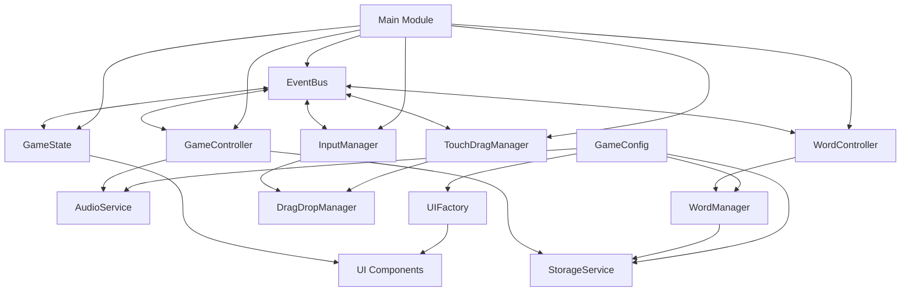
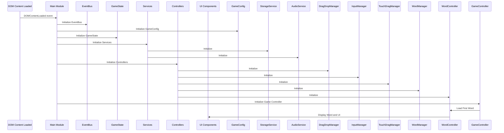
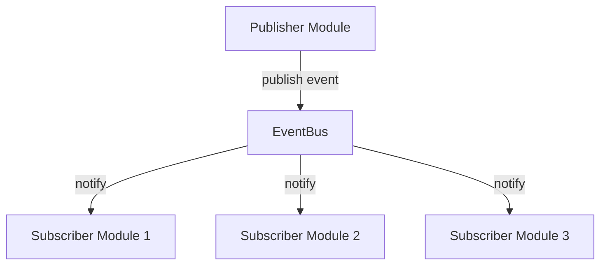
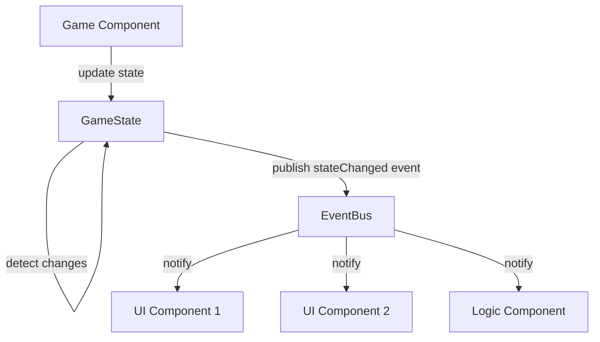
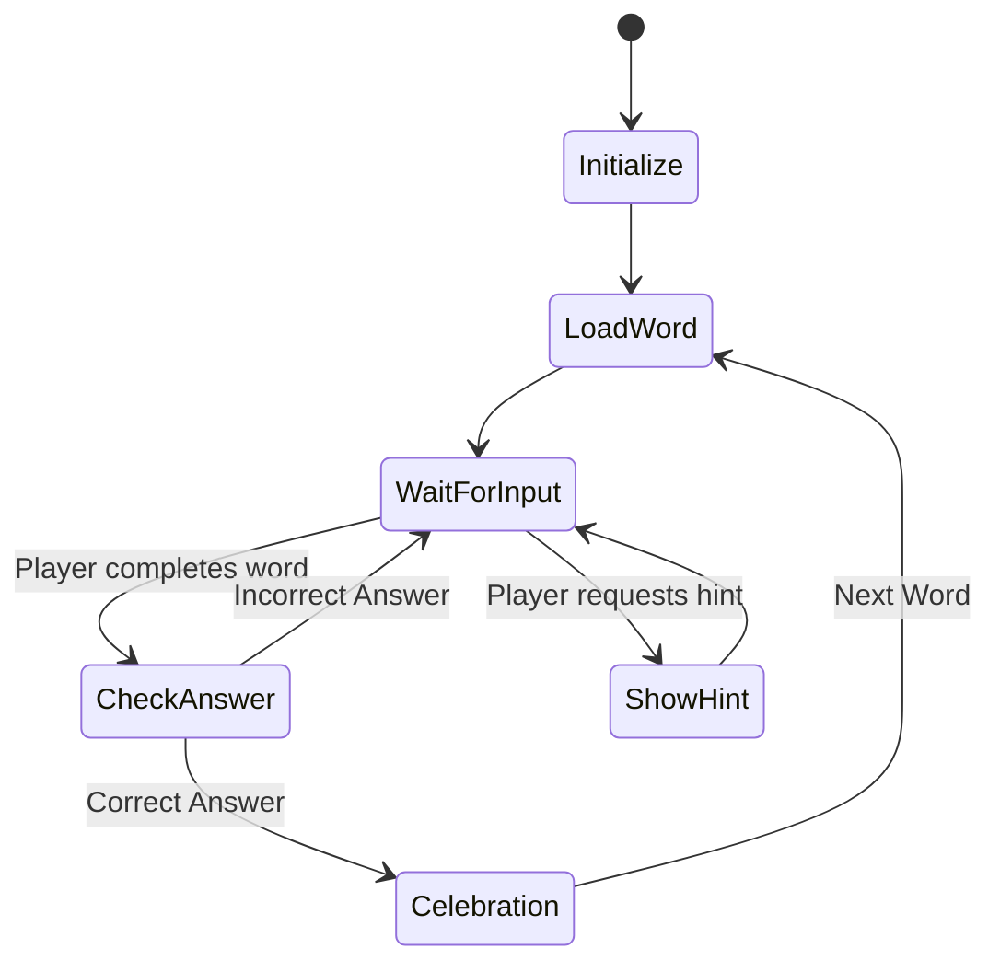
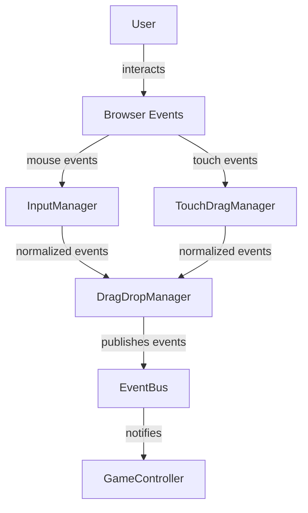

# Architecture Overview

The Word Scramble Game uses an event-driven modular architecture based on the Module Pattern, with centralized state management and clearly separated responsibilities. This architecture enables loose coupling between components while maintaining a predictable data flow.

## Architecture Principles

The application is built around several key architectural principles:

1. **Event-Driven Communication**: Modules communicate through events rather than direct references
2. **Centralized State Management**: All game state is managed in a single location
3. **Module Encapsulation**: Each module has private state and exposes only necessary functionality
4. **Separation of Concerns**: Modules have specific, focused responsibilities
5. **Progressive Enhancement**: Core functionality works across devices with enhanced experiences where supported

## Core Architecture Diagram



## Module Structure

The game's codebase is organized into the following modules:

### Core Infrastructure Modules

1. **EventBus Module** (`eventbus.js`): Central event system enabling decoupled component communication
2. **GameState Module** (`gamestate.js`): State management with change notification
3. **GameConfig Module** (`config.js`): Configuration settings and default values

### Service Modules

4. **StorageService Module** (`storage.js`): Data persistence using localStorage
5. **AudioService Module** (`audio.js`): Sound management and playback

### UI Modules

6. **UIFactory Module** (`ui-factory.js`): Factory methods for UI component creation

### Game Logic Modules

7. **WordManager Module** (`word-manager.js`): Word list and image management
8. **WordController Module** (`wordcontroller.js`): Word loading, scrambling, and hint functionality
9. **GameController Module** (`game-controller.js`): Core game logic and coordination

### Input Handling Modules

10. **DragDropManager Module** (`drag-drop.js`): Basic drag and drop functionality
11. **InputManager Module** (`inputmanager.js`): Unified mouse and touch input handling
12. **TouchDragManager Module** (`touch-drag.js`): Enhanced touch input for mobile

### System Module

13. **Main Module** (`main.js`): Application entry point and initialization

## System Initialization Flow

The application initializes in a specific sequence to ensure dependencies are properly set up:



This initialization sequence ensures that fundamental services like EventBus and GameState are available before modules that depend on them.

## Event-Driven Communication

The EventBus is the central communication mechanism in the application. Modules publish events without knowing which modules will receive them, and subscribe to events they're interested in.



Example of event communication:

```javascript
// Module A publishes an event
EventBus.publish('wordLoaded', { word: 'apple', scrambled: 'pplae' });

// Module B subscribes to the event
EventBus.subscribe('wordLoaded', function(data) {
    console.log('Word loaded:', data.word);
    displayScrambledWord(data.scrambled);
});
```

This event-driven approach allows modules to be developed, tested, and modified independently.

## State Management Flow

The GameState module provides centralized state management with change notifications:



Example of state management:

```javascript
// Update game state
GameState.update({
    score: GameState.get('score') + 10,
    hintUsed: false
});

// Component reacts to state changes
EventBus.subscribe('stateChanged', function(data) {
    if (data.changes.score) {
        updateScoreDisplay(data.changes.score.newValue);
    }
});
```

## Game Flow Diagram

The core gameplay flow follows this sequence:



## Input Handling Architecture

The input system handles both mouse and touch interactions:



This input abstraction ensures consistent behavior across different devices and input methods.

## Module Implementation Pattern

Each module follows the Module Pattern for encapsulation:

```javascript
const ModuleName = (function() {
    // Private variables and functions
    let _privateState = {};
    
    function _privateFunction() {
        // Implementation
    }
    
    // Public API
    return {
        publicMethod: function() {
            _privateFunction();
            return _privateState;
        }
    };
})();

// Export the module
window.ModuleName = ModuleName;
```

This pattern provides several benefits:
- Encapsulation of internal state and logic
- Clear public API boundaries
- Prevention of global namespace pollution
- Controlled access to module functionality

## Key Architecture Patterns

### Publisher-Subscriber (Observer) Pattern

The EventBus implements this pattern, allowing modules to subscribe to events and be notified when they occur:

```javascript
// Module A subscribes to an event
EventBus.subscribe('wordLoaded', wordLoadedHandler);

// Module B publishes the event
EventBus.publish('wordLoaded', { word: 'apple' });
```

### Factory Pattern

The UIFactory creates UI elements with consistent styling and behavior:

```javascript
// Creating a letter tile with the factory
const tile = UIFactory.createLetterTile(
    'A',
    dragStartCallback,
    dragEndCallback
);
```

### Repository Pattern

The StorageService provides a clean interface for data persistence:

```javascript
// Save data
StorageService.saveWords(['apple', 'banana']);

// Retrieve data
const words = StorageService.getWords();
```

### Facade Pattern

The GameController provides a simplified interface to the complex subsystems:

```javascript
// GameController hides the complexity
GameController.init();
```

## Cross-Device Compatibility

The architecture handles different device capabilities through progressive enhancement:

- **Basic Support**: Core drag-and-drop using standard HTML5 API
- **Enhanced Mobile**: Touch-specific optimizations with TouchDragManager
- **Fallback Mechanisms**: Graceful degradation when features aren't available

## SOLID Principles Application

The architecture applies SOLID principles:

1. **Single Responsibility**: Each module has one specific responsibility
2. **Open/Closed**: Modules are extended through events without modifying code
3. **Liskov Substitution**: Input handlers can be substituted without affecting behavior
4. **Interface Segregation**: Modules expose minimal necessary interfaces
5. **Dependency Inversion**: High-level modules depend on abstractions (events)

## Extension Points

The architecture provides several extension points:

### Adding New Game Modes

```javascript
// Create a new controller module
const TimeAttackController = (function() {
    // Implementation
})();

// Subscribe to events
EventBus.subscribe('wordLoaded', function() {
    // Time attack logic
});
```

### Adding New UI Components

```javascript
// Add to UIFactory
UIFactory.createTimerDisplay = function(seconds) {
    // Create timer display
};
```

### Adding New Events

```javascript
// Define new events
EventBus.publish('timeRunningLow', { timeRemaining: 10 });

// Subscribe to new events
EventBus.subscribe('timeRunningLow', function(data) {
    // Handle time running low
});
```

## Performance Considerations

The architecture includes these performance optimizations:

1. **Event Batching**: State changes are batched and published together
2. **Lazy Initialization**: Components initialize only when needed
3. **DOM Caching**: UI elements are cached to minimize DOM lookups
4. **Touch Event Optimization**: Touch events are throttled on mobile

## Security Considerations

The architecture includes these security measures:

1. **Data Validation**: Input is validated before processing
2. **Content Security**: Only uses trusted content sources
3. **Storage Protection**: Sensitive data is not stored

## Conclusion

The Word Scramble Game architecture provides a flexible, maintainable foundation through its event-driven approach, centralized state management, and module encapsulation. This enables features to be developed independently while ensuring a consistent, stable experience across different devices.