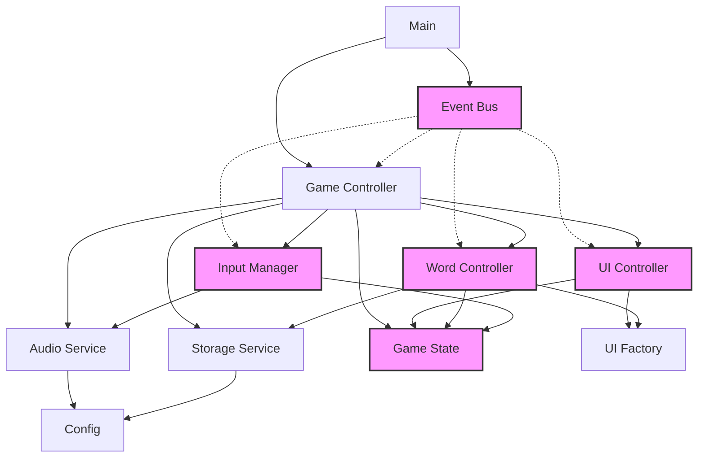
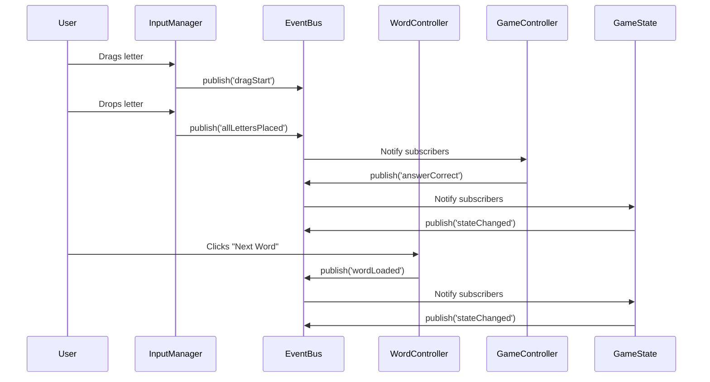

# Architecture Overview

The Word Scramble Game uses a modular architecture based on the Module Pattern, with event-driven communication, centralized state management, and clearly separated responsibilities. Each module has a specific purpose and communicates with other modules through well-defined interfaces.

## Module Structure

The game's codebase is organized into the following modules:

1. **Config Module** (`config.js`): Central configuration hub with application-wide settings
2. **EventBus Module** (`eventbus.js`): Event-based communication system for decoupled modules
3. **GameState Module** (`gamestate.js`): Centralized state management with change notifications
4. **Storage Module** (`storage.js`): Data persistence layer using localStorage
5. **Audio Module** (`audio.js`): Sound management and playback
6. **UI Factory** (`ui-factory.js`): Factory methods for UI element creation
7. **Word Manager** (`word-manager.js`): Word list and image management
8. **Word Controller** (`wordcontroller.js`): Word loading, scrambling, and hint functionality
9. **Input Manager** (`inputmanager.js`): Unified mouse and touch input handling
10. **Game Controller** (`game-controller.js`): Core game coordination and flow
11. **Main** (`main.js`): Application entry point with module initialization

## Architecture Diagram



*Dotted lines represent event-based communication through the EventBus.*

## Key Architectural Patterns

### Module Pattern
Each JavaScript file uses the Module Pattern to encapsulate private state and expose only necessary functionality:

```javascript
const ModuleName = (function() {
    // Private variables and functions
    let _privateVar = 'value';
    
    function _privateMethod() {
        // Implementation
    }
    
    // Public API
    return {
        publicMethod: function() {
            // Uses private variables and methods
            _privateMethod();
            return _privateVar;
        }
    };
})();

// Export the module
window.ModuleName = ModuleName;
```

### Event-Based Communication
The EventBus enables modules to communicate without direct references, reducing coupling:

```javascript
// Publishing an event
EventBus.publish('wordLoaded', { word: 'apple' });

// Subscribing to an event
EventBus.subscribe('wordLoaded', function(data) {
    console.log('Word loaded:', data.word);
});
```

### Centralized State Management
The GameState module provides a single source of truth for application state:

```javascript
// Updating state
GameState.update({
    score: 10,
    currentWord: 'apple'
});

// Getting state
const state = GameState.getState();
console.log(state.score); // 10
```

### Factory Pattern
The UIFactory creates consistent UI elements with proper event handlers:

```javascript
// Creating a letter tile
const tile = UIFactory.createLetterTile(
    'A',
    dragStartCallback,
    dragEndCallback
);
```

### Repository Pattern
The StorageService abstracts data storage operations:

```javascript
// Saving data
StorageService.saveWords(['apple', 'banana']);

// Loading data
const words = StorageService.getWords();
```

## SOLID Principles Applied

The architecture follows SOLID principles:

### Single Responsibility
Each module has a single, well-defined responsibility:
- **EventBus**: Communication between modules
- **GameState**: State management
- **WordController**: Word-related operations
- **InputManager**: Input handling

### Open-Closed
Modules are open for extension but closed for modification. New functionality can be added by:
- Creating new event subscribers
- Extending existing modules with new public methods
- Adding new controllers for specialized functionality

### Liskov Substitution
Interface consistency is maintained throughout the codebase, allowing components to be replaced without affecting the system.

### Interface Segregation
Modules expose focused interfaces specific to their responsibilities rather than large, generic interfaces.

### Dependency Inversion
High-level modules depend on abstractions rather than concrete implementations:
- GameController depends on events and state updates rather than implementation details
- Controllers use abstractions provided by services

## Extension Points

The architecture is designed to be easily extendable:

### Adding New Game Modes
Create a specialized controller that uses existing modules:

```javascript
const TimeAttackController = (function() {
    // Private state
    let _timeRemaining = 60;
    
    // Subscribe to events
    EventBus.subscribe('wordLoaded', function() {
        _resetTimer();
    });
    
    // Public API
    return {
        init: function() {
            // Initialize timer UI
            // Start timer
            return this;
        },
        
        _resetTimer: function() {
            _timeRemaining = 60;
            // Update timer display
        }
    };
})();
```

### Adding New UI Components
Extend the UIFactory with new component creation methods:

```javascript
// Add new method to UIFactory
UIFactory.createTimerDisplay = function(seconds) {
    const timerDisplay = document.createElement('div');
    timerDisplay.className = 'timer-display';
    timerDisplay.textContent = `Time: ${seconds}s`;
    return timerDisplay;
};
```

### Implementing Custom Storage
Modify the StorageService to use a different storage mechanism:

```javascript
// Example using IndexedDB instead of localStorage
function _storeInIndexedDB(key, value) {
    return new Promise((resolve, reject) => {
        const request = indexedDB.open('WordScrambleDB', 1);
        // IndexedDB implementation
    });
}
```

## Event Flow

The game uses events for many key interactions. Here's a simplified event flow diagram:



## Conclusion

The Word Scramble Game architecture follows best practices for modular, maintainable JavaScript applications. By using the Module Pattern, event-driven communication, and centralized state management, the architecture achieves good separation of concerns and extensibility.

The modules are designed with clear responsibilities and interfaces, allowing for easy modification and extension. The use of design patterns and SOLID principles makes the code more robust and maintainable.