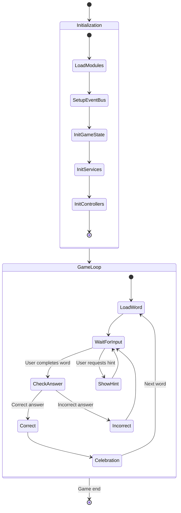

# Code Flow and Logic

This document provides a comprehensive explanation of the Word Scramble Game's code flow, logic, and interactions between components. It serves as a detailed guide for understanding how the application works from initialization to gameplay.

## Application Lifecycle

The application follows this overall lifecycle:



Let's examine each stage of this lifecycle in detail.

## 1. Initialization Process

The initialization begins when the DOM content is loaded, starting the application bootstrap process.

### 1.1 Main Module Initialization

The entry point is in `main.js`:

```javascript
document.addEventListener('DOMContentLoaded', () => {
    console.log('Initializing Word Scramble Game...');
    
    try {
        // Initialize modules in correct order (dependencies first)
        initializeModules();
    } catch (error) {
        console.error('Critical error initializing game:', error);
    }
});
```

### 1.2 Module Initialization Sequence

The modules are initialized in a specific order to ensure dependencies are available:

```javascript
function initializeModules() {
    // 1. Core modules (no dependencies)
    if (window.GameConfig) {
        console.log('GameConfig loaded');
    } else {
        console.error('GameConfig not found!');
    }
    
    // 2. EventBus (communication bus)
    if (window.EventBus) {
        console.log('EventBus loaded');
    } else {
        console.error('EventBus not found!');
        // Create fallback EventBus
    }
    
    // 3. GameState (depends on EventBus)
    if (window.GameState) {
        window.GameState.init();
        console.log('GameState initialized');
    } else {
        console.error('GameState not found!');
    }
    
    // 4. Services (depend on GameConfig)
    if (window.StorageService) console.log('StorageService loaded');
    if (window.AudioService) window.AudioService.init();
    
    // 5. Managers and Controllers
    if (window.DragDropManager) window.DragDropManager.init();
    if (window.InputManager) window.InputManager.init();
    if (window.TouchDragManager) window.TouchDragManager.init();
    
    // 6. Word Management
    if (window.WordManager) {
        const wordManagerElements = {
            newWordInput: document.getElementById('new-word-input'),
            addWordBtn: document.getElementById('add-word-btn'),
            imageUploadArea: document.getElementById('image-upload-area'),
            imageUpload: document.getElementById('image-upload'),
            imagePreview: document.getElementById('image-preview'),
            wordList: document.getElementById('word-items')
        };
        window.WordManager.init(wordManagerElements);
    }
    
    if (window.WordController) window.WordController.init();
    
    // 7. Game Controller (depends on all other modules)
    if (window.GameController) {
        window.GameController.init();
        console.log('Game initialization complete!');
    }
}
```

### 1.3 DOM Element Setup

During initialization, each module retrieves and caches its required DOM elements:

```javascript
// Example from GameController
_elements = {
    wordImage: document.getElementById('word-image'),
    dropArea: document.getElementById('drop-area'),
    scrambledWord: document.getElementById('scrambled-word'),
    scoreElement: document.getElementById('score'),
    checkBtn: document.getElementById('check-btn'),
    nextBtn: document.getElementById('next-btn'),
    hintBtn: document.getElementById('hint-btn'),
    // ...other elements
};
```

### 1.4 Event Subscription Setup

Modules subscribe to events they need to respond to:

```javascript
// Example from GameController
_setupEventSubscriptions() {
    // Subscribe to game events
    window.EventBus.subscribe('allLettersPlaced', _checkAnswer);
    window.EventBus.subscribe('answerCorrect', _handleCorrectAnswer);
    window.EventBus.subscribe('wordLoaded', _handleWordLoaded);
    
    // Subscribe to UI events
    window.EventBus.subscribe('checkButtonClicked', _checkAnswer);
    window.EventBus.subscribe('nextButtonClicked', _loadNextWord);
}
```

### 1.5 Initial Game State Setup

The game state is initialized to default values:

```javascript
_state = {
    currentWord: '',
    scrambledWord: '',
    currentImageUrl: '',
    score: 0,
    hintUsed: false,
    availableWords: []
};
```

### 1.6 Load Saved Data

Saved data is loaded from localStorage:

```javascript
function _loadSavedData() {
    // Load saved score
    _state.score = window.StorageService.getScore();
    _elements.scoreElement.textContent = _state.score;
    
    // Load saved words
    _state.availableWords = window.StorageService.getWords();
}
```

## 2. Word Loading Process

Once initialization is complete, the game loads the first word.

### 2.1 Word Selection

The `WordController` selects a random word from the available words:

```javascript
function _loadNextWord() {
    try {
        // Reset hint status
        window.GameState.update({
            hintUsed: false
        });
        
        // Get available words
        let availableWords = window.GameState.get('availableWords');
        if (availableWords.length === 0) {
            // Replenish word list if empty
            availableWords = window.WordManager.getWords();
            window.GameState.update({ availableWords });
        }
        
        // Choose a random word
        const randomIndex = Math.floor(Math.random() * availableWords.length);
        const currentWord = availableWords[randomIndex];
        
        // Remove word from available words
        const updatedWords = [...availableWords];
        updatedWords.splice(randomIndex, 1);
        
        // Get image URL for word
        const currentImageUrl = window.WordManager.getWordImage(currentWord);
        
        // Scramble the word
        const scrambledWord = _scrambleWord(currentWord);
        
        // Update state
        window.GameState.update({
            currentWord,
            scrambledWord,
            currentImageUrl,
            availableWords: updatedWords
        });
        
        // Set up pronunciation
        if (window.AudioService) {
            window.AudioService.setupPronunciation(currentWord);
        }
        
        // Publish event
        window.EventBus.publish('wordLoaded', {
            word: currentWord,
            scrambled: scrambledWord
        });
        
        return true;
    } catch (error) {
        console.error('Error loading next word:', error);
        // ... error handling ...
    }
}
```

### 2.2 Word Scrambling

The selected word is scrambled using a Fisher-Yates shuffle:

```javascript
function _scrambleWord(word) {
    const wordArray = word.split('');
    
    // Fisher-Yates shuffle
    for (let i = wordArray.length - 1; i > 0; i--) {
        const j = Math.floor(Math.random() * (i + 1));
        [wordArray[i], wordArray[j]] = [wordArray[j], wordArray[i]];
    }
    
    let scrambled = wordArray.join('');
    
    // If scrambled word is the same as original, try again
    if (scrambled === word && word.length > 1) {
        return _scrambleWord(word);
    }
    
    return scrambled;
}
```

### 2.3 UI Setup for New Word

When a new word is loaded, the UI is updated:

```javascript
function _handleWordLoaded(data) {
    // Create letter boxes in drop area
    _createLetterBoxes(data.word.length);
    
    // Display scrambled word
    _displayScrambledWord(data.scrambled);
    
    // Display word image if available
    _displayWordImage();
    
    // Reset check button
    if (_elements.checkBtn) {
        _elements.checkBtn.disabled = false;
    }
}
```

### 2.4 Creating Letter Boxes

Letter boxes are created for each letter in the word:

```javascript
function _createLetterBoxes(wordLength) {
    // Clear drop area
    _elements.dropArea.innerHTML = '';
    
    // Create a letter box for each character
    for (let i = 0; i < wordLength; i++) {
        // Create letter box
        const letterBox = window.UIFactory.createLetterBox(
            i,
            _getLetterBoxCallbacks()
        );
        
        _elements.dropArea.appendChild(letterBox);
    }
}
```

### 2.5 Displaying Scrambled Word

The scrambled word is displayed as draggable letter tiles:

```javascript
function _displayScrambledWord(scrambledWord) {
    // Clear scrambled word area
    _elements.scrambledWord.innerHTML = '';
    
    // Create letter tiles for each character
    for (let i = 0; i < scrambledWord.length; i++) {
        const letter = scrambledWord[i];
        
        // Create a letter tile
        const letterTile = window.UIFactory.createLetterTile(
            letter,
            window.DragDropManager.dragStart,
            window.DragDropManager.dragEnd
        );
        
        // Add to scrambled word area
        _elements.scrambledWord.appendChild(letterTile);
    }
}
```

## 3. User Interaction Flow

Once the word is loaded, the user can interact with the game.

### 3.1 Drag and Drop Interaction

The main user interaction is dragging letters to form the word:

#### 3.1.1 Start Drag Operation

```javascript
function _handleDragStart(e) {
    _draggingItem = e.target;
    e.dataTransfer.setData('text/plain', e.target.id);
    e.target.classList.add('dragging');
    
    // Record original position
    _originalPosition = {
        parent: e.target.parentElement,
        nextSibling: e.target.nextElementSibling
    };
    
    // Create a better drag image
    // ... drag image creation ...
    
    // Play drag sound
    window.AudioService.playSound('drag');
    
    // Publish drag start event
    window.EventBus.publish('dragStart', {
        element: e.target,
        id: e.target.id,
        sourceContainer: e.target.closest('.letter-box') ? 'letter-box' : 'scrambled-word'
    });
}
```

#### 3.1.2 Drop on Letter Box

```javascript
function _handleDropOnLetterBox(e) {
    e.preventDefault();
    e.currentTarget.classList.remove('drag-over');
    
    // Get the dragged element data
    const id = e.dataTransfer.getData('text/plain');
    const draggedElement = document.getElementById(id);
    
    if (!draggedElement) return;
    
    const letterBox = e.currentTarget;
    
    // Check if the letter box already has a letter
    const existingTile = letterBox.querySelector('.letter-tile');
    
    if (existingTile) {
        // Swap with existing tile
        // ... swapping logic ...
    } else {
        // Empty box - just move the tile there
        letterBox.appendChild(draggedElement);
    }
    
    // Play drop sound
    window.AudioService.playSound('drop');
    
    // Check if all letter boxes are filled
    _checkCompleteness();
}
```

#### 3.1.3 Check Completeness

```javascript
function _checkCompleteness() {
    // Check if all letter boxes are filled
    const allBoxesFilled = _elements.dropArea.querySelectorAll('.letter-box:empty').length === 0;
    
    if (allBoxesFilled) {
        // Small delay to ensure DOM updates are complete
        setTimeout(() => {
            // Publish event to trigger answer checking
            window.EventBus.publish('allLettersPlaced', null);
        }, 100);
    }
}
```

### 3.2 Touch Handling Flow

On touch devices, the interaction flow is slightly different:

#### 3.2.1 Touch Start

```javascript
function _handleTouchStart(e) {
    e.preventDefault();
    
    const touch = e.touches[0];
    const target = document.elementFromPoint(touch.clientX, touch.clientY);
    
    if (!target.classList.contains('letter-tile')) return;
    
    _draggingItem = target;
    _draggingItem.classList.add('dragging');
    
    // Create clone for visual feedback
    _createDragClone(target, touch);
    
    // Publish event
    window.EventBus.publish('touchDragStart', {
        element: target,
        id: target.id
    });
}
```

#### 3.2.2 Touch Move

```javascript
function _handleTouchMove(e) {
    if (!_draggingItem || !_dragTileClone) return;
    
    e.preventDefault();
    
    const touch = e.touches[0];
    
    // Move clone with touch
    _positionCloneAtTouch(touch);
    
    // Find potential drop target
    const elementUnderTouch = document.elementFromPoint(touch.clientX, touch.clientY);
    const dropTarget = _findDropTarget(elementUnderTouch);
    
    // Highlight drop target
    _highlightDropTarget(dropTarget);
}
```

#### 3.2.3 Touch End

```javascript
function _handleTouchEnd(e) {
    if (!_draggingItem || !_dragTileClone) return;
    
    e.preventDefault();
    
    const touch = e.changedTouches[0];
    
    // Find drop target
    const elementUnderTouch = document.elementFromPoint(touch.clientX, touch.clientY);
    const dropTarget = _findDropTarget(elementUnderTouch);
    
    if (dropTarget) {
        // Handle drop based on target type
        if (dropTarget.classList.contains('letter-box')) {
            _handleDropInLetterBox(dropTarget);
        } else if (dropTarget.id === 'scrambled-word') {
            _handleDropInScrambledArea(dropTarget);
        }
    } else {
        // Return to original position
        _returnToOriginalPosition();
    }
    
    // Clean up
    _cleanupDrag();
}
```

### 3.3 UI Button Interactions

The game also supports button interactions:

#### 3.3.1 Hint Button

```javascript
document.getElementById('hint-btn').addEventListener('click', function() {
    // Publish event when hint button is clicked
    window.EventBus.publish('hintButtonClicked', null);
});

// In WordController
window.EventBus.subscribe('hintButtonClicked', function() {
    _showHint();
});

function _showHint() {
    // Mark hint as used
    window.GameState.update({
        hintUsed: true
    });
    
    // Play hint sound
    window.AudioService.playSound('hint');
    
    // Find first letter and place it
    // ... hint implementation ...
}
```

#### 3.3.2 Next Word Button

```javascript
document.getElementById('next-btn').addEventListener('click', function() {
    // Publish event when next button is clicked
    window.EventBus.publish('nextButtonClicked', null);
});

// In WordController
window.EventBus.subscribe('nextButtonClicked', function() {
    _loadNextWord();
});
```

#### 3.3.3 Pronounce Button

```javascript
document.getElementById('pronounce-btn').addEventListener('click', function() {
    // Publish event when pronounce button is clicked
    window.EventBus.publish('pronounceButtonClicked', null);
});

// In AudioService
window.EventBus.subscribe('pronounceButtonClicked', function() {
    AudioService.pronounceWord();
});
```

## 4. Answer Verification Process

When the user completes the word, the answer is verified.

### 4.1 Triggering Answer Check

Answer checking is triggered in two ways:
1. When all letter boxes are filled (event: `allLettersPlaced`)
2. When the check button is clicked (event: `checkButtonClicked`)

```javascript
// Subscribe to both events
window.EventBus.subscribe('allLettersPlaced', _checkAnswer);
window.EventBus.subscribe('checkButtonClicked', _checkAnswer);
```

### 4.2 Answer Checking Logic

```javascript
function _checkAnswer() {
    // Get current game state
    const gameState = window.GameState.getState();
    
    // Get all letter boxes and extract the letters
    const letterBoxes = Array.from(_elements.dropArea.querySelectorAll('.letter-box'));
    const userAnswer = letterBoxes
        .map(box => {
            const letterTile = box.querySelector('.letter-tile');
            return letterTile ? letterTile.textContent.trim() : '';
        })
        .join('');
    
    // Compare with current word
    if (userAnswer.toLowerCase() === gameState.currentWord.toLowerCase()) {
        // Correct answer
        _handleCorrectAnswer(userAnswer);
    } else {
        // Incorrect answer
        _handleIncorrectAnswer(userAnswer);
    }
}
```

### 4.3 Handling Correct Answer

```javascript
function _handleCorrectAnswer(userAnswer) {
    const gameState = window.GameState.getState();
    
    // Play correct sound
    window.AudioService.playSound('correct');
    window.AudioService.pronounceWord();
    
    // Update score based on hint usage
    const scoreIncrement = gameState.hintUsed ? 
        window.GameConfig.get('scoreIncrement').withHint : 
        window.GameConfig.get('scoreIncrement').withoutHint;
    
    const newScore = gameState.score + scoreIncrement;
    
    // Update game state
    window.GameState.update({
        score: newScore
    });
    
    // Save score to storage
    window.StorageService.saveScore(newScore);
    
    // Visual feedback
    _highlightCorrectAnswer();
    
    // Publish correct answer event
    window.EventBus.publish('answerCorrect', {
        word: gameState.currentWord,
        score: newScore
    });
    
    // Show celebration after delay
    setTimeout(() => {
        _showCelebration();
    }, 500);
}
```

### 4.4 Handling Incorrect Answer

```javascript
function _handleIncorrectAnswer(userAnswer) {
    const gameState = window.GameState.getState();
    
    // Play wrong sound
    window.AudioService.playSound('wrong');
    
    // Visual feedback for incorrect answer
    const dropArea = document.getElementById('drop-area');
    dropArea.classList.add('shake');
    setTimeout(() => {
        dropArea.classList.remove('shake');
    }, 500);
    
    // Publish incorrect answer event
    window.EventBus.publish('answerIncorrect', {
        userAnswer,
        correctWord: gameState.currentWord
    });
}
```

## 5. Celebration and Next Word Process

After a correct answer, the game shows a celebration and moves to the next word.

### 5.1 Celebration Animation

```javascript
function _showCelebration() {
    const celebrationElement = document.getElementById('celebration-element');
    
    // Show celebration animation
    if (celebrationElement) {
        celebrationElement.classList.add('show');
    }
    
    // Play celebration sound
    window.AudioService.playCelebration();
    
    // Reset the celebration after the animation completes
    setTimeout(() => {
        if (celebrationElement) {
            celebrationElement.classList.remove('show');
        }
        
        // Load next word after a short delay
        setTimeout(() => {
            window.WordController.loadNextWord();
        }, 500);
    }, window.GameConfig.get('celebrationDuration') || 2000);
}
```

### 5.2 Audio Celebration Sequence

```javascript
playCelebration: function() {
    this.playSound('correct');
    
    // Play whistle with a slight delay
    setTimeout(() => {
        this.playSound('whistle');
    }, 300);
    
    // Play clapping with a slight delay
    setTimeout(() => {
        this.playSound('clapping');
    }, 600);
    
    return true;
}
```

### 5.3 Next Word Transition

The next word loading process is triggered either:
1. After the celebration (automatic transition)
2. When the next button is clicked

```javascript
function _loadNextWord() {
    // Reset the UI state
    _resetUIState();
    
    // Trigger word loading in WordController
    window.WordController.loadNextWord();
}

function _resetUIState() {
    // Reset letter boxes
    _elements.dropArea.innerHTML = '';
    
    // Reset scrambled word area
    _elements.scrambledWord.innerHTML = '';
    
    // Reset button states
    if (_elements.checkBtn) {
        _elements.checkBtn.disabled = false;
    }
}
```

## 6. Hint System Flow

The hint system helps users by revealing the first letter.

### 6.1 Hint Activation

```javascript
// User clicks the hint button
document.getElementById('hint-btn').addEventListener('click', function() {
    window.EventBus.publish('hintButtonClicked', null);
});

// In WordController
EventBus.subscribe('hintButtonClicked', function() {
    _showHint();
});
```

### 6.2 Hint Implementation

```javascript
function _showHint() {
    // Mark hint as used
    window.GameState.update({
        hintUsed: true
    });
    
    // Play hint sound
    window.AudioService.playSound('hint');
    
    // Find the first letter of the current word
    const firstLetter = window.GameState.get('currentWord').charAt(0);
    
    // Find matching letter in the scrambled word area
    const letterTiles = document.querySelectorAll('.letter-tile');
    let matchingTile = null;
    
    for (const tile of letterTiles) {
        if (tile.textContent.toLowerCase() === firstLetter.toLowerCase()) {
            matchingTile = tile;
            break;
        }
    }
    
    if (matchingTile) {
        // Get the first letter box
        const firstLetterBox = document.querySelector('.letter-box[data-position="0"]');
        
        // If first letter box is empty
        if (firstLetterBox && !firstLetterBox.querySelector('.letter-tile')) {
            // Create a clone of the tile
            const clone = matchingTile.cloneNode(true);
            clone.addEventListener('dragstart', function(e) {
                window.DragDropManager.dragStart(e);
            });
            clone.addEventListener('dragend', function(e) {
                window.DragDropManager.dragEnd(e);
            });
            
            // Add to first letter box
            firstLetterBox.appendChild(clone);
            
            // Remove original tile
            matchingTile.remove();
            
            // Check if answer is now complete
            const allBoxesFilled = document.querySelectorAll('.letter-box:empty').length === 0;
            if (allBoxesFilled) {
                setTimeout(() => {
                    window.EventBus.publish('allLettersPlaced', null);
                }, 100);
            }
        }
    }
}
```

## 7. Word Pronunciation Flow

The game includes word pronunciation capability.

### 7.1 Setting Up Pronunciation

```javascript
setupPronunciation: function(word) {
    if (!_pronunciationAudio) return false;
    
    // Use the Google Text-to-Speech API
    const ttsUrl = `https://translate.google.com/translate_tts?ie=UTF-8&client=tw-ob&tl=en&q=${encodeURIComponent(word)}`;
    _pronunciationAudio.src = ttsUrl;
    _pronunciationAudio.load();
    return true;
}
```

### 7.2 Pronouncing the Word

```javascript
pronounceWord: function() {
    if (!_pronunciationAudio) return false;
    
    try {
        _pronunciationAudio.play();
        return true;
    } catch (error) {
        console.error('Error playing pronunciation:', error);
        return false;
    }
}
```

### 7.3 Pronunciation Triggers

Pronunciation is triggered in multiple scenarios:
1. When the pronounce button is clicked
2. When a correct answer is verified
3. During the celebration sequence

```javascript
// Button click
document.getElementById('pronounce-btn').addEventListener('click', function() {
    window.AudioService.pronounceWord();
});

// On correct answer
function _handleCorrectAnswer() {
    // Other handling...
    window.AudioService.pronounceWord();
    // More handling...
}
```

## 8. Word Management Flow

The game allows users to manage the word list.

### 8.1 Adding a Word

```javascript
function _addWordToList() {
    const wordInput = _elements.newWordInput;
    const word = wordInput.value.trim().toLowerCase();
    
    // Validate word
    if (!word) {
        alert('Please enter a word.');
        return;
    }
    
    // Check if word already exists
    if (_words.includes(word)) {
        alert('This word is already in the list.');
        return;
    }
    
    // Add word to the list
    _words.push(word);
    
    // Associate image with word if uploaded
    if (_tempImageData) {
        _wordImages[word] = _tempImageData;
        _tempImageData = null;
    }
    
    // Create word item in UI
    const wordItem = window.UIFactory.createWordItem(
        word, 
        _wordImages[word] || null,
        _removeWord
    );
    
    _elements.wordList.appendChild(wordItem);
    
    // Clear input and preview
    wordInput.value = '';
    window.UIFactory.resetImagePreview(_elements.imagePreview);
    
    // Save word data
    _saveWordData();
}
```

### 8.2 Removing a Word

```javascript
function _removeWord(wordItem, word) {
    // Remove from arrays
    const index = _words.indexOf(word);
    if (index !== -1) {
        _words.splice(index, 1);
    }
    
    // Remove image association
    if (_wordImages[word]) {
        delete _wordImages[word];
    }
    
    // Remove from UI
    wordItem.remove();
    
    // Save word data
    _saveWordData();
}
```

### 8.3 Saving Word Data

```javascript
function _saveWordData() {
    window.StorageService.saveWords(_words);
    window.StorageService.saveWordImages(_wordImages);
}
```

### 8.4 Loading Word Data

```javascript
function _loadWordData() {
    _words = window.StorageService.getWords();
    _wordImages = window.StorageService.getWordImages();
}
```

## 9. State Management Flow

The game uses centralized state management through the GameState module.

### 9.1 State Update Flow

```javascript
// In various modules
window.GameState.update({
    score: currentScore + points,
    hintUsed: true
});

// In GameState module
update: function(newValues) {
    try {
        // Store the old state for change detection
        const oldState = {..._state};
        
        // Update state
        _state = {..._state, ...newValues};
        
        // Detect changes
        const changes = _getChanges(oldState, _state);
        
        // Notify about state changes if any occurred
        if (Object.keys(changes).length > 0) {
            _safelyPublishEvent('stateChanged', {
                changes,
                oldState,
                newState: {..._state}
            });
        }
        
        return true;
    } catch (error) {
        console.error('Error updating game state:', error);
        return false;
    }
}
```

### 9.2 State Change Reaction

```javascript
// Subscribe to state changes
window.EventBus.subscribe('stateChanged', function(data) {
    // Update score display if score changed
    if (data.changes.score) {
        document.getElementById('score').textContent = data.changes.score.newValue;
    }
    
    // Update UI for new word
    if (data.changes.currentWord) {
        // Update word display
    }
    
    // React to hint status change
    if (data.changes.hintUsed) {
        // Update UI for hint status
    }
});
```

## 10. Audio System Flow

The audio system handles sound effects and word pronunciation.

### 10.1 Audio Initialization

```javascript
init: function() {
    // Initialize audio elements
    _sounds = {
        correct: _getAudioElement('correct-sound'),
        wrong: _getAudioElement('wrong-sound'),
        drag: _getAudioElement('drag-sound'),
        hint: _getAudioElement('hint-sound'),
        clapping: _getAudioElement('clapping-sound'),
        whistle: _getAudioElement('whistle-sound')
    };
    
    _pronunciationAudio = _getAudioElement('pronunciation');
    
    // Preload audio
    Object.values(_sounds).forEach(sound => {
        if (sound) sound.load();
    });
    
    return this;
}
```

### 10.2 Sound Playback

```javascript
playSound: function(soundType) {
    const audio = _sounds[soundType];
    if (!audio) {
        console.error(`Sound type '${soundType}' not found.`);
        return false;
    }
    
    try {
        audio.currentTime = 0;
        audio.play().catch(error => {
            console.error(`Error playing audio:`, error);
        });
        return true;
    } catch (error) {
        console.error(`Error with audio playback:`, error);
        return false;
    }
}
```

### 10.3 Celebration Sound Sequence

```javascript
playCelebration: function() {
    this.playSound('correct');
    
    // Play whistle with a slight delay
    setTimeout(() => {
        this.playSound('whistle');
    }, 300);
    
    // Play clapping with a slight delay
    setTimeout(() => {
        this.playSound('clapping');
    }, 600);
    
    return true;
}
```

## 11. Error Handling Flow

The application includes comprehensive error handling throughout the codebase.

### 11.1 Critical Error Handling

```javascript
try {
    // Initialize modules in correct order
    initializeModules();
} catch (error) {
    console.error('Critical error initializing game:', error);
    
    // Display error message to user
    const gameArea = document.querySelector('.game-area');
    if (gameArea) {
        gameArea.innerHTML = `
            <div class="error-message">
                <h2>Error Loading Game</h2>
                <p>There was a problem loading the game. Please try refreshing the page.</p>
                <p>Error details: ${error.message}</p>
            </div>
        `;
    }
}
```

### 11.2 Module-Level Error Handling

```javascript
// Example from WordController
function _loadNextWord() {
    try {
        // Word loading logic...
    } catch (error) {
        console.error('Error loading next word:', error);
        
        // Fallback to a simple word
        const currentWord = 'apple';
        const scrambledWord = 'pplea';
        
        // Update with fallback values
        window.GameState.update({
            currentWord,
            scrambledWord
        });
        
        // Create letter boxes and display fallback word
        _createLetterBoxes(currentWord);
        _displayScrambledWord(scrambledWord);
        
        // Publish error event
        window.EventBus.publish('wordLoadError', {
            error,
            fallbackWord: currentWord
        });
    }
}
```

### 11.3 Function-Level Error Handling

```javascript
// Example from AudioService
playSound: function(soundType) {
    const audio = _sounds[soundType];
    if (!audio) {
        console.error(`Sound type '${soundType}' not found.`);
        return false;
    }
    
    try {
        audio.currentTime = 0;
        audio.play().catch(error => {
            console.error(`Error playing audio:`, error);
        });
        return true;
    } catch (error) {
        console.error(`Error with audio playback:`, error);
        return false;
    }
}
```

### 11.4 Missing Module Fallbacks

```javascript
// Create fallback EventBus if not found
if (!window.EventBus) {
    console.warn('EventBus not found. Creating minimal fallback implementation.');
    window.EventBus = {
        subscribe: function() { return false; },
        publish: function() { return false; },
        unsubscribe: function() { return false; }
    };
}
```

## 12. Mobile-Specific Logic Flow

The application includes specialized logic for mobile devices.

### 12.1 Device Detection

```javascript
function _detectTouchSupport() {
    return 'ontouchstart' in window || 
           navigator.maxTouchPoints > 0 || 
           navigator.msMaxTouchPoints > 0;
}

if (_detectTouchSupport()) {
    // Enable touch-specific features
    _setupTouchHandlers();
    _addTouchStyles();
}
```

### 12.2 Touch-Specific Styles

```javascript
function _addTouchStyles() {
    const style = document.createElement('style');
    style.id = 'touch-drag-styles';
    style.textContent = `
        .letter-tile {
            -webkit-touch-callout: none;
            -webkit-user-select: none;
            -webkit-tap-highlight-color: transparent;
            touch-action: none;
        }
        
        .touch-clone {
            position: fixed;
            z-index: 9999;
            opacity: 0.8;
            pointer-events: none;
            transition: none;
            box-shadow: 0 5px 15px rgba(0, 0, 0, 0.3);
        }
        
        .letter-box.drag-highlight {
            background-color: rgba(142, 68, 173, 0.2);
            border: 2px solid #8e44ad;
            transform: scale(1.1);
        }
    `;
    document.head.appendChild(style);
}
```

### 12.3 Touch Drag Clone Creation

```javascript
function _createDragClone(element, touch) {
    const rect = element.getBoundingClientRect();
    
    // Create clone
    _dragTileClone = element.cloneNode(true);
    _dragTileClone.classList.add('touch-clone');
    _dragTileClone.style.width = `${rect.width}px`;
    _dragTileClone.style.height = `${rect.height}px`;
    
    // Position clone at touch point
    _positionCloneAtTouch(touch);
    
    // Add to body
    document.body.appendChild(_dragTileClone);
    
    // Make original semi-transparent
    element.style.opacity = '0.4';
}
```

## 13. Storage and Persistence Flow

The game uses localStorage for data persistence.

### 13.1 Saving Data

```javascript
function _safelySetItem(key, value) {
    try {
        localStorage.setItem(key, JSON.stringify(value));
        return true;
    } catch (error) {
        console.error(`Error saving ${key} to localStorage:`, error);
        return false;
    }
}

saveWords: function(words) {
    return _safelySetItem(GameConfig.get('storage').words, words);
}

saveScore: function(score) {
    return _safelySetItem(GameConfig.get('storage').score, score);
}
```

### 13.2 Loading Data

```javascript
function _safelyGetItem(key, defaultValue) {
    try {
        const item = localStorage.getItem(key);
        return item ? JSON.parse(item) : defaultValue;
    } catch (error) {
        console.error(`Error retrieving ${key} from localStorage:`, error);
        return defaultValue;
    }
}

getWords: function() {
    return _safelyGetItem(
        GameConfig.get('storage').words, 
        GameConfig.get('defaultWords')
    );
}

getScore: function() {
    return _safelyGetItem(GameConfig.get('storage').score, 0);
}
```

### 13.3 Data Loading Flow

```javascript
// In game initialization
function _loadSavedData() {
    // Load saved score
    const savedScore = window.StorageService.getScore();
    window.GameState.update({ score: savedScore });
    
    // Load saved words
    const savedWords = window.StorageService.getWords();
    window.GameState.update({ availableWords: savedWords });
    
    // Load saved word images
    const savedWordImages = window.StorageService.getWordImages();
    // Use saved word images...
}
```

## 14. Progressive Web App Features

The game includes PWA support for offline usage.

### 14.1 Service Worker Registration

```javascript
// Service worker registration
if ('serviceWorker' in navigator && window.location.protocol !== 'file:') {
    window.addEventListener('load', () => {
        navigator.serviceWorker.register('js/service-worker.js')
            .then(registration => {
                console.log('ServiceWorker registration successful with scope: ', registration.scope);
            })
            .catch(error => {
                console.error('ServiceWorker registration failed: ', error);
            });
    });
}
```

### 14.2 Cache Management

```javascript
// In service-worker.js
const CACHE_NAME = 'word-scramble-v1';
const urlsToCache = [
    '/',
    '/index.html',
    '/style.css',
    '/manifest.json',
    '/icon-192x192.png',
    '/icon-512x512.png',
    '/js/main.js',
    '/js/config.js',
    // ... other resources
];

self.addEventListener('install', (event) => {
    event.waitUntil(
        caches.open(CACHE_NAME)
            .then((cache) => cache.addAll(urlsToCache))
    );
});

self.addEventListener('fetch', (event) => {
    event.respondWith(
        caches.match(event.request)
            .then((response) => {
                if (response) {
                    return response;
                }
                return fetch(event.request);
            })
    );
});
```

## 15. Share Functionality Flow

The game includes sharing capabilities.

### 15.1 Share Button Creation

```javascript
function addShareButton() {
    // Create a share button container
    const shareButtonContainer = document.createElement('div');
    shareButtonContainer.className = 'share-button-container';
    
    // Create main share button
    const shareButton = document.createElement('button');
    shareButton.className = 'game-btn primary share-btn';
    shareButton.innerHTML = '<i class="fas fa-share-alt"></i> Share Game';
    
    // Create share dropdown
    const shareDropdown = document.createElement('div');
    shareDropdown.className = 'share-dropdown';
    
    // Add share options
    // ... add share options ...
    
    // Append elements
    shareButtonContainer.appendChild(shareButton);
    shareButtonContainer.appendChild(shareDropdown);
    
    // Add button to the game area
    const buttonContainer = document.querySelector('.buttons-container');
    if (buttonContainer) {
        buttonContainer.appendChild(shareButtonContainer);
    }
}
```

### 15.2 Share Functionality

```javascript
function shareGame(method) {
    // Base share content
    const gameTitle = "Word Scramble Game";
    const gameDescription = "Check out this fun educational word scramble game!";
    const gameUrl = window.location.href;
    const shareText = `${gameDescription} Play it here: ${gameUrl}`;
    
    // Get current score
    let score = "";
    if (window.GameState) {
        score = window.GameState.get('score') || "";
        if (score) {
            score = ` My current score is ${score}!`;
        }
    }
    
    const scoreShareText = `${shareText}${score}`;
    
    // Handle different share methods
    switch (method) {
        case 'native':
            // Use Web Share API if available
            if (navigator.share) {
                navigator.share({
                    title: gameTitle,
                    text: gameDescription + score,
                    url: gameUrl
                }).then(() => {
                    console.log('Shared successfully');
                    // Publish share success event
                    if (window.EventBus) {
                        window.EventBus.publish('shareSuccess', { method: 'native' });
                    }
                }).catch((error) => {
                    console.error('Error sharing:', error);
                });
            }
            break;
            
        case 'email':
            // Open default email client
            const emailSubject = encodeURIComponent(gameTitle);
            const emailBody = encodeURIComponent(scoreShareText);
            window.open(`mailto:?subject=${emailSubject}&body=${emailBody}`);
            break;
            
        // ... other share methods ...
    }
}
```

## Conclusion

This document has provided a comprehensive overview of the Word Scramble Game's code flow and logic. By understanding these interactions and processes, developers can effectively maintain, debug, and extend the game's functionality.

The event-driven architecture, modular design, and clear separation of concerns enable the game to be both maintainable and extensible, allowing for new features to be added without disrupting existing functionality.