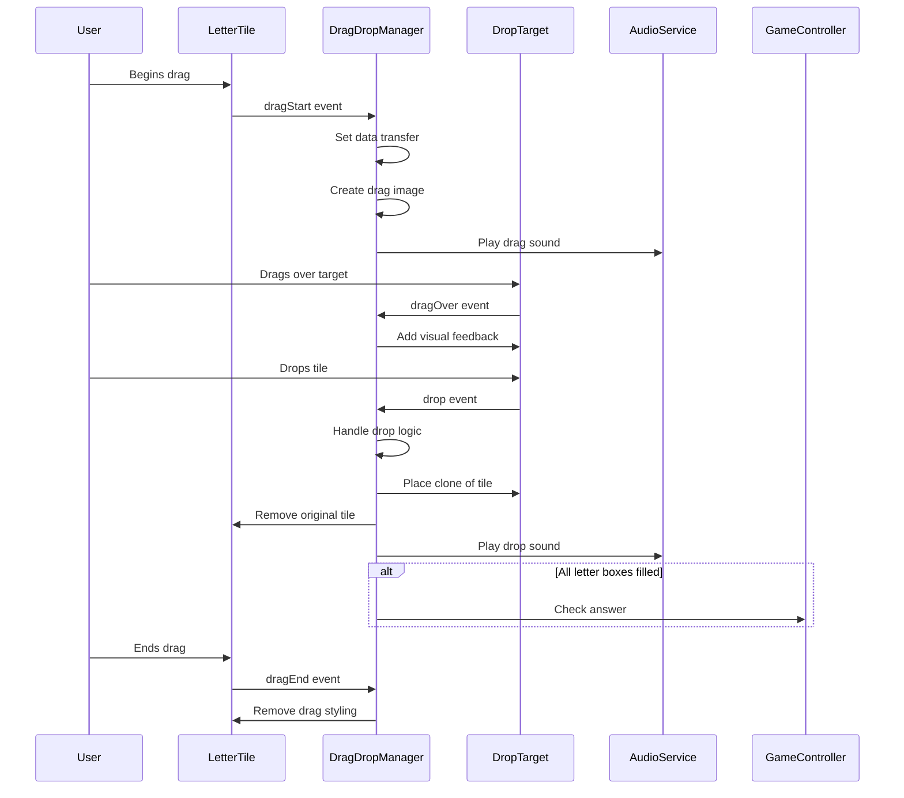

# Drag and Drop Module

The Drag and Drop Module handles all drag and drop interactions in the game.

## Purpose

This module provides functionality for:
- Handling drag start and end events
- Managing drop zones and drop events
- Providing visual feedback during drag operations
- Handling letter tile placement logic

## Implementation

The Drag-Drop Manager uses the Module Pattern:

```javascript
const DragDropManager = (function() {
    // Private state
    let _draggedItem = null;
    let _gameController = null;
    
    // Public API
    return {
        /**
         * Initialize drag and drop manager
         * @param {Object} gameController - Reference to game controller
         * @returns {Object} DragDropManager for chaining
         */
        init: function(gameController) {
            _gameController = gameController;
            return this;
        },
        
        /**
         * Handle drag start event
         * @param {Event} e - Drag start event
         */
        dragStart: function(e) {
            _draggedItem = e.target;
            e.dataTransfer.setData('text/plain', e.target.id);
            e.target.classList.add('dragging');
            
            // Create a better drag image that's visible during dragging
            const dragImage = e.target.cloneNode(true);
            dragImage.style.width = '50px';
            dragImage.style.height = '50px';
            dragImage.style.opacity = '0.9';
            dragImage.style.position = 'absolute';
            dragImage.style.top = '-1000px';
            document.body.appendChild(dragImage);
            
            // Set the custom drag image
            e.dataTransfer.setDragImage(dragImage, 25, 25);
            
            // Remove the temporary element after a short delay
            setTimeout(() => {
                document.body.removeChild(dragImage);
            }, 0);
            
            // Play drag sound
            window.AudioService.playSound('drag');
        },
        
        /**
         * Handle drag end event
         * @param {Event} e - Drag end event
         */
        dragEnd: function(e) {
            e.target.classList.remove('dragging');
            _draggedItem = null;
        },
        
        // ... other methods ...
        
        /**
         * Set up drop area event listeners
         * @param {HTMLElement} dropArea - Drop area element
         * @param {Function} checkAnswerCallback - Callback to check answer
         */
        setupDropAreaListeners: function(dropArea, checkAnswerCallback) {
            dropArea.addEventListener('dragover', this.dragOver);
            
            // Set up drop handler on main drop area
            dropArea.addEventListener('drop', (e) => {
                this.dropOnMainArea(e, dropArea, checkAnswerCallback);
            });
            
            return this;
        },
        
        /**
         * Set up scrambled area event listeners
         * @param {HTMLElement} scrambledArea - Scrambled word element
         */
        setupScrambledAreaListeners: function(scrambledArea) {
            scrambledArea.addEventListener('dragover', this.dragOver);
            
            // Set up drop handler on scrambled area
            scrambledArea.addEventListener('drop', (e) => {
                this.dropOnScrambledArea(e, scrambledArea);
            });
            
            return this;
        },
        
        /**
         * Get drop callbacks for letter boxes
         * @param {Function} checkAnswerCallback - Callback to check answer
         * @returns {Object} Object with callback functions
         */
        getLetterBoxCallbacks: function(checkAnswerCallback) {
            return {
                dragOver: this.dragOver,
                dragEnter: this.dragEnter,
                dragLeave: this.dragLeave,
                drop: (e) => this.dropOnLetterBox(e, checkAnswerCallback)
            };
        }
    };
})();
```

## Drag and Drop Flow

The module implements a sophisticated drag and drop system:



## Key Features

### Custom Drag Image

The module creates a custom drag image for a better user experience:

```javascript
// Create a better drag image that's visible during dragging
const dragImage = e.target.cloneNode(true);
dragImage.style.width = '50px';
dragImage.style.height = '50px';
dragImage.style.opacity = '0.9';
dragImage.style.position = 'absolute';
dragImage.style.top = '-1000px';
document.body.appendChild(dragImage);

// Set the custom drag image
e.dataTransfer.setDragImage(dragImage, 25, 25);
```

### Drop Handling

The module handles drops in different scenarios:

1. **Drop on Letter Box**: Places a letter in a specific box position
2. **Drop on Main Area**: Finds the first empty letter box
3. **Drop on Scrambled Area**: Returns a letter to the scrambled word area

### Letter Swapping

The module supports swapping letters when dropping on an occupied letter box:

```javascript
// If target already has a letter tile, we need to swap them
if (existingTile) {
    // Create a clone of the existing tile
    const existingClone = existingTile.cloneNode(true);
    existingClone.classList.remove('dragging');
    
    // Add event listeners to the existing tile clone
    existingClone.addEventListener('dragstart', this.dragStart);
    existingClone.addEventListener('dragend', this.dragEnd);
    
    // First remove the existing tile from the target
    existingTile.remove();
    
    // Then append the dragged tile clone to the target
    targetBox.appendChild(clone);
    
    // Replace the dragged element with the existing tile clone
    if (originalParent) {
        draggedElement.remove();
        originalParent.appendChild(existingClone);
    }
}
```

### Visual Feedback

The module provides visual feedback during drag operations:

- Highlighting drop targets
- Styling dragged items
- Animating transitions

## Public Methods

| Method | Description |
|--------|-------------|
| `init(gameController)` | Initializes the drag and drop manager |
| `dragStart(e)` | Handles the start of a drag operation |
| `dragEnd(e)` | Handles the end of a drag operation |
| `dragOver(e)` | Handles dragover events |
| `dragEnter(e)` | Handles dragenter events |
| `dragLeave(e)` | Handles dragleave events |
| `dropOnLetterBox(e, checkAnswerCallback)` | Handles drops on letter boxes |
| `dropOnMainArea(e, dropArea, checkAnswerCallback)` | Handles drops on the main drop area |
| `dropOnScrambledArea(e, scrambledWordElement)` | Handles drops back to the scrambled area |
| `setupDropAreaListeners(dropArea, checkAnswerCallback)` | Sets up drop area event listeners |
| `setupScrambledAreaListeners(scrambledArea)` | Sets up scrambled area event listeners |
| `getLetterBoxCallbacks(checkAnswerCallback)` | Gets callbacks for letter boxes |

## Usage

The Drag-Drop Manager is initialized by the Game Controller:

```javascript
// Initialize drag and drop manager
window.DragDropManager.init(this)
    .setupDropAreaListeners(_elements.dropArea, _checkAnswer)
    .setupScrambledAreaListeners(_elements.scrambledWord);
```

Letter boxes are created with drag and drop callbacks:

```javascript
// Create letter boxes
for (let i = 0; i < _gameState.currentWord.length; i++) {
    const letterBox = window.UIFactory.createLetterBox(
        i,
        window.DragDropManager.getLetterBoxCallbacks(_checkAnswer)
    );
    _elements.dropArea.appendChild(letterBox);
}
```

This implementation provides a smooth and intuitive drag and drop experience that is essential for the game's core gameplay mechanics.
