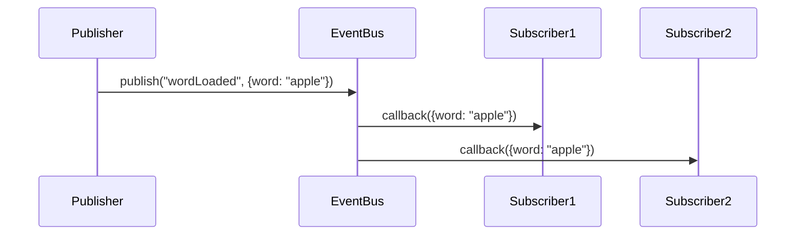

# EventBus Module

The EventBus module is the central communication system of the Word Scramble Game, implementing the Publisher-Subscriber (Observer) pattern to enable decoupled communication between modules.

## Purpose and Functionality

The EventBus serves these key purposes:

1. **Decoupling Modules**: Allows modules to communicate without direct references
2. **Centralized Communication**: Provides a single channel for all application events
3. **Dynamic Relationships**: Enables runtime subscription to events
4. **Clean Architecture**: Supports separation of concerns and modular design

## Implementation Details

The EventBus is implemented using the Module Pattern with a clean, focused API:

```javascript
/**
 * EventBus Module for Word Scramble Game
 * Provides a central event system for communication between modules
 */
const EventBus = (function() {
    // Private state
    const _events = {};
    
    // Private methods
    
    /**
     * Validate event name format
     * @param {string} eventName - Name of the event
     * @returns {boolean} Whether the event name is valid
     */
    function _validateEventName(eventName) {
        if (typeof eventName !== 'string') {
            console.error('Event name must be a string');
            return false;
        }
        if (eventName.trim() === '') {
            console.error('Event name cannot be empty');
            return false;
        }
        return true;
    }
    
    /**
     * Validate callback is a function
     * @param {Function} callback - Callback function
     * @returns {boolean} Whether the callback is valid
     */
    function _validateCallback(callback) {
        if (typeof callback !== 'function') {
            console.error('Callback must be a function');
            return false;
        }
        return true;
    }
    
    // Public API
    return {
        /**
         * Subscribe to an event
         * @param {string} eventName - Name of the event
         * @param {Function} callback - Callback function
         * @returns {boolean} Success status
         */
        subscribe: function(eventName, callback) {
            if (!_validateEventName(eventName) || !_validateCallback(callback)) {
                return false;
            }
            
            if (!_events[eventName]) {
                _events[eventName] = [];
            }
            
            // Avoid duplicate subscriptions
            if (!_events[eventName].includes(callback)) {
                _events[eventName].push(callback);
            }
            
            return true;
        },
        
        /**
         * Unsubscribe from an event
         * @param {string} eventName - Name of the event
         * @param {Function} callback - Callback function
         * @returns {boolean} Success status
         */
        unsubscribe: function(eventName, callback) {
            if (!_validateEventName(eventName) || !_validateCallback(callback)) {
                return false;
            }
            
            if (!_events[eventName]) {
                return false;
            }
            
            const initialLength = _events[eventName].length;
            _events[eventName] = _events[eventName].filter(cb => cb !== callback);
            
            return _events[eventName].length < initialLength;
        },
        
        /**
         * Publish an event
         * @param {string} eventName - Name of the event
         * @param {*} data - Data to pass to subscribers
         * @returns {boolean} Success status
         */
        publish: function(eventName, data) {
            if (!_validateEventName(eventName)) {
                return false;
            }
            
            if (!_events[eventName]) {
                return false;
            }
            
            try {
                _events[eventName].forEach(callback => callback(data));
                return true;
            } catch (error) {
                console.error(`Error publishing event "${eventName}":`, error);
                return false;
            }
        },
        
        /**
         * Clear all subscriptions for an event
         * @param {string} eventName - Name of the event
         * @returns {boolean} Success status
         */
        clearEvent: function(eventName) {
            if (!_validateEventName(eventName)) {
                return false;
            }
            
            if (!_events[eventName]) {
                return false;
            }
            
            delete _events[eventName];
            return true;
        },
        
        /**
         * Get all registered events
         * @returns {Array} Array of event names
         */
        getEvents: function() {
            return Object.keys(_events);
        }
    };
})();

// Export the module
window.EventBus = EventBus;
```

## Key Functions

The module exposes five primary functions:

### subscribe(eventName, callback)

Registers a callback function to be called when the specified event is published.

**Parameters**:
- `eventName` (string): The name of the event to subscribe to
- `callback` (function): The function to be called when the event occurs

**Returns**: boolean - Whether the subscription was successful

**Example**:
```javascript
EventBus.subscribe('wordLoaded', function(data) {
    console.log('Word loaded:', data.word);
    displayScrambledWord(data.scrambled);
});
```

### publish(eventName, data)

Broadcasts an event to all subscribers with optional data.

**Parameters**:
- `eventName` (string): The name of the event to publish
- `data` (any): Data to pass to subscriber callbacks

**Returns**: boolean - Whether the event was successfully published

**Example**:
```javascript
EventBus.publish('wordLoaded', {
    word: 'apple',
    scrambled: 'ppale'
});
```

### unsubscribe(eventName, callback)

Removes a specific callback from the subscribers of an event.

**Parameters**:
- `eventName` (string): The name of the event
- `callback` (function): The callback function to remove

**Returns**: boolean - Whether the unsubscription was successful

**Example**:
```javascript
// Define the callback function
function wordLoadedHandler(data) {
    console.log('Word loaded:', data.word);
}

// Subscribe
EventBus.subscribe('wordLoaded', wordLoadedHandler);

// Later, unsubscribe
EventBus.unsubscribe('wordLoaded', wordLoadedHandler);
```

### clearEvent(eventName)

Removes all subscribers for a specific event.

**Parameters**:
- `eventName` (string): The name of the event to clear

**Returns**: boolean - Whether the event was successfully cleared

**Example**:
```javascript
// Remove all subscribers from the 'wordLoaded' event
EventBus.clearEvent('wordLoaded');
```

### getEvents()

Returns an array of all event names that have subscribers.

**Returns**: Array - Array of event names

**Example**:
```javascript
// Get all events with subscribers
const activeEvents = EventBus.getEvents();
console.log('Active events:', activeEvents);
```

## Event Flow

When an event is published, the EventBus notifies all subscribers in the order they were registered:



## Core Application Events

The Word Scramble Game uses these core events:

| Event Name | Description | Data Payload | Publisher |
|------------|-------------|--------------|-----------|
| `gameInitialized` | Game has been initialized | `null` | GameController |
| `wordLoaded` | New word has been loaded | `{word, scrambled}` | WordController |
| `letterDropped` | A letter was dropped | `{letter, targetBox}` | InputManager |
| `allLettersPlaced` | All letter boxes are filled | `null` | InputManager |
| `answerCorrect` | User answer is correct | `{word, score}` | GameController |
| `answerIncorrect` | User answer is incorrect | `{userAnswer, correctWord}` | GameController |
| `stateChanged` | Game state was updated | `{changes, oldState, newState}` | GameState |
| `hintButtonClicked` | Hint button was clicked | `null` | InputManager |
| `nextButtonClicked` | Next Word button was clicked | `null` | InputManager |
| `dragStart` | Drag operation started | `{element, id, sourceContainer}` | InputManager |
| `dragEnd` | Drag operation ended | `{element, id}` | InputManager |
| `touchDragStart` | Touch drag started | `{element, id, touch, sourceContainer}` | TouchDragManager |
| `touchDragMove` | Touch drag moved | `{element, id, touch, dropTarget}` | TouchDragManager |
| `touchDragEnd` | Touch drag ended | `{success, target}` | TouchDragManager |

## Event Subscription Map

This table shows which modules subscribe to which events:

| Event | Subscribers |
|-------|-------------|
| `gameInitialized` | Main |
| `wordLoaded` | GameController, UIFactory |
| `allLettersPlaced` | GameController |
| `answerCorrect` | GameController, WordController |
| `answerIncorrect` | GameController |
| `stateChanged` | GameController, UIFactory |
| `hintButtonClicked` | WordController |
| `nextButtonClicked` | WordController |
| `dragStart` | DragDropManager |
| `touchDragStart` | TouchDragManager |

## Implementation Details

### Error Handling

The EventBus includes robust error handling:

1. **Validation**: Validates event names and callbacks before processing
2. **Error Catching**: Catches and logs errors during callback execution
3. **Defensive Programming**: Checks for existence of event arrays

### Preventing Memory Leaks

To prevent memory leaks, the module:

1. Avoids duplicate subscriptions
2. Provides unsubscribe functionality
3. Allows clearing all subscriptions for an event

## Usage Patterns

### Component Communication

```javascript
// Module A: Word Controller
function loadNextWord() {
    const randomWord = getRandomWord();
    const scrambledWord = scrambleWord(randomWord);
    
    // Notify other components about the new word
    EventBus.publish('wordLoaded', {
        word: randomWord,
        scrambled: scrambledWord
    });
}

// Module B: UI Controller
EventBus.subscribe('wordLoaded', function(data) {
    displayScrambledWord(data.scrambled);
    createLetterBoxes(data.word.length);
});
```

### UI Event Handling

```javascript
// Convert DOM events to application events
document.getElementById('hint-btn').addEventListener('click', function() {
    // Publish an application event when the button is clicked
    EventBus.publish('hintButtonClicked', null);
});

// React to the application event
EventBus.subscribe('hintButtonClicked', function() {
    showHint();
});
```

### State Change Notification

```javascript
// Publish state changes
function updateScore(points) {
    const newScore = currentScore + points;
    
    // Notify about the score change
    EventBus.publish('stateChanged', {
        changes: {
            score: {
                oldValue: currentScore,
                newValue: newScore
            }
        }
    });
    
    currentScore = newScore;
}
```

## Best Practices

### Naming Conventions

Event names should follow these conventions:
- Use camelCase for event names
- Use past tense for state changes: `wordLoaded`, `scoreUpdated`
- Use present tense for actions: `checkAnswer`, `showHint`

### Event Data Structure

When publishing events with data:
- Use descriptive property names
- Include all necessary data to reduce coupling
- Avoid including DOM elements directly (use IDs instead)
- Keep data structures consistent for similar events

### Subscription Management

To manage subscriptions effectively:
- Store callback references to enable unsubscription
- Unsubscribe when components are destroyed
- Group related subscriptions for easier management

```javascript
// Good practice
const callbacks = {
    wordLoaded: function(data) { /* handle word */ },
    scoreUpdated: function(data) { /* handle score */ }
};

// Subscribe
EventBus.subscribe('wordLoaded', callbacks.wordLoaded);
EventBus.subscribe('scoreUpdated', callbacks.scoreUpdated);

// Later, unsubscribe all
EventBus.unsubscribe('wordLoaded', callbacks.wordLoaded);
EventBus.unsubscribe('scoreUpdated', callbacks.scoreUpdated);
```

### Error Handling in Subscribers

Subscribers should handle their own errors to prevent blocking other subscribers:

```javascript
// Good practice
EventBus.subscribe('wordLoaded', function(data) {
    try {
        processWord(data.word);
    } catch (error) {
        console.error('Error processing word:', error);
        // Graceful fallback
    }
});
```

## Debugging Tips

To debug events:

1. **Event Logging**: Add a general subscriber to log all events
```javascript
EventBus.subscribe('*', function(eventName, data) {
    console.log(`Event: ${eventName}`, data);
});
```

2. **Breakpoints**: Set breakpoints in event publisher and subscriber code
3. **Event Counts**: Count event occurrences to detect excessive events

## Extension Points

The EventBus can be extended with additional functionality:

### Event Prioritization

Add priority to subscribers to control execution order:

```javascript
// Extended subscribe with priority
subscribe: function(eventName, callback, priority = 0) {
    // Implementation with priority sorting
}
```

### Asynchronous Event Processing

Support for asynchronous event handlers:

```javascript
// Async publish
publishAsync: function(eventName, data) {
    setTimeout(() => {
        this.publish(eventName, data);
    }, 0);
}
```

### Event Wildcards

Support for wildcard subscriptions:

```javascript
// Subscribe to all events matching a pattern
subscribePattern: function(pattern, callback) {
    // Implementation with pattern matching
}
```

## Conclusion

The EventBus is the backbone of the Word Scramble Game's architecture, enabling loose coupling between modules while facilitating clear, predictable communication paths. By centralizing event handling, it simplifies the overall system architecture and makes the application more maintainable and extensible.