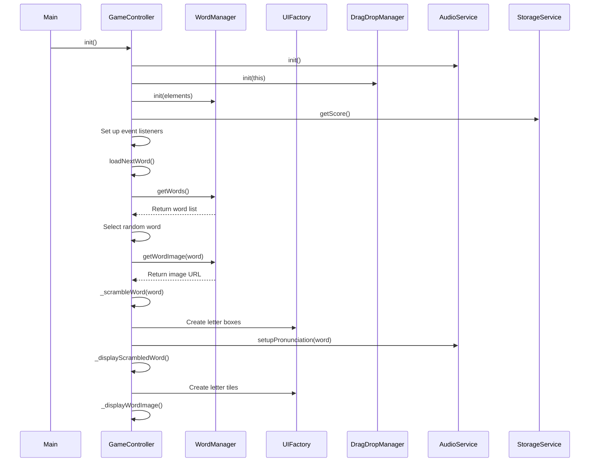

# Game Controller Module

The Game Controller Module orchestrates the game flow and coordinates between other modules.

## Purpose

This module serves as the central controller for the game, responsible for:
- Initializing all other modules
- Managing game state
- Handling game logic (word loading, checking answers, etc.)
- Coordinating between UI, audio, and data modules

## Implementation

The Game Controller uses the Module Pattern:

```javascript
const GameController = (function() {
    // Private state
    let _gameState = {
        currentWord: '',
        scrambledWord: '',
        currentImageUrl: '',
        score: 0,
        hintUsed: false,
        availableWords: []
    };
    
    // DOM elements
    let _elements = {
        wordImage: null,
        dropArea: null,
        scrambledWord: null,
        scoreElement: null,
        checkBtn: null,
        nextBtn: null,
        hintBtn: null,
        pronounceBtn: null,
        celebrationOverlay: null,
        celebrationElement: null
    };
    
    // Private methods
    
    /**
     * Scramble a word using Fisher-Yates shuffle
     * @param {string} word - Word to scramble
     * @returns {string} Scrambled word
     */
    function _scrambleWord(word) {
        const wordArray = word.split('');
        
        // Fisher-Yates shuffle
        for (let i = wordArray.length - 1; i > 0; i--) {
            const j = Math.floor(Math.random() * (i + 1));
            [wordArray[i], wordArray[j]] = [wordArray[j], wordArray[i]];
        }
        
        let scrambled = wordArray.join('');
        
        // If scrambled word is the same as original, try again
        if (scrambled === word && word.length > 1) {
            return _scrambleWord(word);
        }
        
        return scrambled;
    }
    
    /**
     * Display the scrambled word
     */
    function _displayScrambledWord() {
        // Clear scrambled word area
        _elements.scrambledWord.innerHTML = '';
        
        // Create letter tiles
        _gameState.scrambledWord.split('').forEach(letter => {
            const tile = window.UIFactory.createLetterTile(
                letter,
                window.DragDropManager.dragStart.bind(window.DragDropManager),
                window.DragDropManager.dragEnd.bind(window.DragDropManager)
            );
            _elements.scrambledWord.appendChild(tile);
        });
    }
    
    /**
     * Display the word image
     */
    function _displayWordImage() {
        if (_gameState.currentImageUrl) {
            _elements.wordImage.src = _gameState.currentImageUrl;
            _elements.wordImage.alt = _gameState.currentWord;
            _elements.wordImage.style.display = 'block';
        } else {
            // Generate Unsplash image URL
            const imageUrl = `https://source.unsplash.com/300x300/?${encodeURIComponent(_gameState.currentWord)}`;
            _elements.wordImage.src = imageUrl;
            _elements.wordImage.alt = _gameState.currentWord;
            _elements.wordImage.style.display = 'block';
        }
    }
    
    /**
     * Show celebration and prepare for next word
     */
    function _showCelebration() {
        // Show celebration animation
        _elements.celebrationElement.classList.add('show');
        
        // Play celebration sound
        window.AudioService.playCelebration();
        
        // Reset the celebration after the animation completes
        setTimeout(() => {
            _elements.celebrationElement.classList.remove('show');
            
            // Load next word after a short delay
            setTimeout(() => {
                loadNextWord();
            }, 500);
        }, window.GameConfig.get('celebrationDuration') || 2000);
    }
    
    /**
     * Check if the answer is correct
     */
    function _checkAnswer() {
        // Get all letter boxes and extract the letters in their current order
        const letterBoxes = Array.from(_elements.dropArea.querySelectorAll('.letter-box'));
        const userAnswer = letterBoxes
            .map(box => {
                const letterTile = box.querySelector('.letter-tile');
                return letterTile ? letterTile.textContent.trim() : '';
            })
            .join('');
        
        // Compare with current word
        if (userAnswer.toLowerCase() === _gameState.currentWord.toLowerCase()) {
            // Correct answer
            window.AudioService.playSound('correct');
            window.AudioService.pronounceWord();
            
            // Update score based on hint usage
            if (!_gameState.hintUsed) {
                _gameState.score += window.GameConfig.get('scoreIncrement').withoutHint;
            } else {
                _gameState.score += window.GameConfig.get('scoreIncrement').withHint;
            }
            
            // Update score display
            _elements.scoreElement.textContent = _gameState.score;
            
            // Save the score
            window.StorageService.saveScore(_gameState.score);
            
            // Disable check button and highlight boxes as correct
            _elements.checkBtn.disabled = true;
            
            letterBoxes.forEach(box => {
                box.classList.add('correct');
                const tile = box.querySelector('.letter-tile');
                if (tile) tile.classList.add('correct');
            });
            
            // Show celebration after a short delay
            setTimeout(_showCelebration, 500);
        } else {
            // Incorrect answer
            window.AudioService.playSound('wrong');
            
            // Visual feedback for incorrect answer
            _elements.dropArea.classList.add('shake');
            setTimeout(() => {
                _elements.dropArea.classList.remove('shake');
            }, 500);
        }
    }
    
    /**
     * Show a hint (first letter)
     */
    function _showHint() {
        // Mark hint as used
        _gameState.hintUsed = true;
        
        // Play hint sound
        window.AudioService.playSound('hint');
        
        // Find the first letter of the current word
        const firstLetter = _gameState.currentWord.charAt(0);
        
        // Find matching letter in the scrambled word area
        const letterTiles = _elements.scrambledWord.querySelectorAll('.letter-tile');
        let matchingTile = null;
        
        for (const tile of letterTiles) {
            if (tile.textContent.toLowerCase() === firstLetter.toLowerCase()) {
                matchingTile = tile;
                break;
            }
        }
        
        if (matchingTile) {
            // Get the first letter box
            const firstLetterBox = _elements.dropArea.querySelector('.letter-box[data-position="0"]');
            
            // If first letter box is empty
            if (firstLetterBox && !firstLetterBox.hasChildNodes()) {
                // Clone the tile
                const clone = matchingTile.cloneNode(true);
                clone.addEventListener('dragstart', window.DragDropManager.dragStart.bind(window.DragDropManager));
                clone.addEventListener('dragend', window.DragDropManager.dragEnd.bind(window.DragDropManager));
                
                // Add to first letter box
                firstLetterBox.appendChild(clone);
                
                // Remove original tile
                matchingTile.remove();
                
                // Check if answer is now complete
                const allBoxesFilled = _elements.dropArea.querySelectorAll('.letter-box:empty').length === 0;
                if (allBoxesFilled) {
                    _checkAnswer();
                }
            }
        }
    }
    
    /**
     * Load the next word
     */
    function loadNextWord() {
        try {
            // Reset hint status
            _gameState.hintUsed = false;
            
            // Get words from Word Manager
            if (_gameState.availableWords.length === 0) {
                _gameState.availableWords = window.WordManager.getWords();
                
                // Fallback to default words if no words available
                if (!_gameState.availableWords || _gameState.availableWords.length === 0) {
                    _gameState.availableWords = ['apple', 'banana', 'cat', 'dog', 'elephant'];
                    console.log('Using fallback words');
                }
            }
            
            // Choose a random word
            const randomIndex = Math.floor(Math.random() * _gameState.availableWords.length);
            _gameState.currentWord = _gameState.availableWords[randomIndex];
            
            // Remove word from available words to prevent repetition
            _gameState.availableWords.splice(randomIndex, 1);
            
            // Get image URL for word
            _gameState.currentImageUrl = window.WordManager.getWordImage(_gameState.currentWord);
            
            // Scramble the word
            _gameState.scrambledWord = _scrambleWord(_gameState.currentWord);
            
            // Clear drop area
            _elements.dropArea.innerHTML = '';
            
            // Remove instruction text after first word
            const instructionPara = _elements.dropArea.querySelector('p');
            if (instructionPara) {
                instructionPara.remove();
            }
            
            // Enable check button
            if (_elements.checkBtn) {
                _elements.checkBtn.disabled = false;
            }
            
            // Create placeholder boxes for each letter of the word
            for (let i = 0; i < _gameState.currentWord.length; i++) {
                const letterBox = window.UIFactory.createLetterBox(
                    i,
                    window.DragDropManager.getLetterBoxCallbacks(_checkAnswer)
                );
                _elements.dropArea.appendChild(letterBox);
            }
            
            // Set up pronunciation
            window.AudioService.setupPronunciation(_gameState.currentWord);
            
            // Display scrambled word and image
            _displayScrambledWord();
            _displayWordImage();
            
            console.log('Loaded new word:', _gameState.currentWord);
        } catch (error) {
            console.error('Error loading next word:', error);
            // Fallback to a simple word in case of error
            _gameState.currentWord = 'apple';
            _gameState.scrambledWord = 'pplea';
            _displayScrambledWord();
        }
    }
    
    // Public API
    return {
        /**
         * Initialize the game
         * @returns {Object} GameController for chaining
         */
        init: function() {
            // Get DOM elements
            _elements = {
                wordImage: window.document.getElementById('word-image'),
                dropArea: window.document.getElementById('drop-area'),
                scrambledWord: window.document.getElementById('scrambled-word'),
                scoreElement: window.document.getElementById('score'),
                checkBtn: window.document.getElementById('check-btn'),
                nextBtn: window.document.getElementById('next-btn'),
                hintBtn: window.document.getElementById('hint-btn'),
                pronounceBtn: window.document.getElementById('pronounce-btn'),
                celebrationOverlay: window.document.getElementById('celebration-overlay'),
                celebrationElement: window.document.getElementById('celebration-element')
            };
            
            // Clear and prepare drop area with child-friendly instructions
            _elements.dropArea.innerHTML = '';
            const instructionPara = window.document.createElement('p');
            instructionPara.textContent = 'Drop letters here to form the word';
            instructionPara.classList.add('drop-instruction');
            _elements.dropArea.appendChild(instructionPara);
            
            // Initialize audio service
            window.AudioService.init();
            
            // Initialize drag and drop manager
            window.DragDropManager.init(this)
                .setupDropAreaListeners(_elements.dropArea, _checkAnswer)
                .setupScrambledAreaListeners(_elements.scrambledWord);
            
            // Initialize word manager
            window.WordManager.init({
                newWordInput: window.document.getElementById('new-word-input'),
                addWordBtn: window.document.getElementById('add-word-btn'),
                imageUploadArea: window.document.getElementById('image-upload-area'),
                imageUpload: window.document.getElementById('image-upload'),
                imagePreview: window.document.getElementById('image-preview'),
                wordList: window.document.getElementById('word-items')
            });
            
            // Load saved score
            _gameState.score = window.StorageService.getScore();
            _elements.scoreElement.textContent = _gameState.score;
            
            // Set up button listeners
            if (_elements.checkBtn) {
                _elements.checkBtn.addEventListener('click', _checkAnswer);
            }
            
            if (_elements.nextBtn) {
                _elements.nextBtn.addEventListener('click', loadNextWord);
            }
            
            if (_elements.hintBtn) {
                _elements.hintBtn.addEventListener('click', _showHint);
            }
            
            if (_elements.pronounceBtn) {
                _elements.pronounceBtn.addEventListener('click', () => {
                    window.AudioService.pronounceWord();
                });
            }
            
            // Load first word
            loadNextWord();
            
            return this;
        },
        
        /**
         * Get current game state
         * @returns {Object} Game state object
         */
        getGameState: function() {
            return { ..._gameState }; // Return a copy
        },
        
        /**
         * Load next word (exposed for external access)
         */
        loadNextWord: loadNextWord,
        
        /**
         * Check answer (exposed for external access)
         */
        checkAnswer: _checkAnswer,
        
        /**
         * Show hint (exposed for external access)
         */
        showHint: _showHint
    };
})();
```

## Game Flow Sequence



## Game State

The module maintains the following game state:

| Property | Description |
|----------|-------------|
| `currentWord` | The current word to be unscrambled |
| `scrambledWord` | The scrambled version of the current word |
| `currentImageUrl` | URL of the image for the current word |
| `score` | Player's current score |
| `hintUsed` | Whether a hint was used for the current word |
| `availableWords` | Array of words available for selection |

## Key Features

### Word Scrambling

The module uses the Fisher-Yates shuffle algorithm to randomize the letters in a word:

```javascript
function _scrambleWord(word) {
    const wordArray = word.split('');
    
    // Fisher-Yates shuffle
    for (let i = wordArray.length - 1; i > 0; i--) {
        const j = Math.floor(Math.random() * (i + 1));
        [wordArray[i], wordArray[j]] = [wordArray[j], wordArray[i]];
    }
    
    let scrambled = wordArray.join('');
    
    // If scrambled word is the same as original, try again
    if (scrambled === word && word.length > 1) {
        return _scrambleWord(word);
    }
    
    return scrambled;
}
```

This ensures the letters are truly randomized, with a check to prevent the scrambled word from being identical to the original word.

### Answer Checking

The module verifies the user's answer by collecting the letters from the drop area and comparing them to the current word:

```javascript
function _checkAnswer() {
    const letterBoxes = Array.from(_elements.dropArea.querySelectorAll('.letter-box'));
    const userAnswer = letterBoxes
        .map(box => {
            const letterTile = box.querySelector('.letter-tile');
            return letterTile ? letterTile.textContent.trim() : '';
        })
        .join('');
    
    // Compare with current word (case-insensitive)
    if (userAnswer.toLowerCase() === _gameState.currentWord.toLowerCase()) {
        // Correct answer
        // ... handle correct answer ...
    } else {
        // Incorrect answer
        // ... handle incorrect answer ...
    }
}
```

### Hint System

The module provides a hint system that places the first letter of the word in the correct position:

```javascript
function _showHint() {
    _gameState.hintUsed = true;
    
    // ... find and place first letter ...
    
    // Play hint sound
    window.AudioService.playSound('hint');
}
```

Using a hint reduces the points earned for the current word, encouraging players to try solving without assistance first.

## Public Methods

| Method | Description |
|--------|-------------|
| `init()` | Initializes the game controller and other modules |
| `getGameState()` | Returns a copy of the current game state |
| `loadNextWord()` | Loads the next word (exposed for external access) |
| `checkAnswer()` | Checks the current answer (exposed for external access) |
| `showHint()` | Shows a hint (exposed for external access) |

## Module Coordination

The Game Controller coordinates between all other modules:

- **Storage Service**: For loading/saving score and word data
- **Audio Service**: For sound effects and word pronunciation
- **UI Factory**: For creating UI elements
- **Word Manager**: For word and image data
- **Drag-Drop Manager**: For drag and drop functionality

This central coordination role makes the Game Controller the heart of the application, orchestrating all game functionality.
