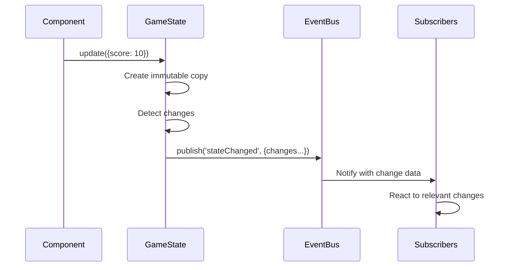

# GameState Module

The GameState module provides centralized state management for the Word Scramble Game, acting as the single source of truth for application state and notifying components of state changes.

## Purpose and Functionality

The GameState module serves these key purposes:

1. **State Centralization**: Maintains all game state in one place
2. **Change Detection**: Identifies and reports specific state changes
3. **Immutable Updates**: Provides a clean pattern for state updates
4. **Change Notification**: Notifies components when state changes
5. **State Consistency**: Ensures all components see the same state

## Implementation Details

The GameState module is implemented using the Module Pattern with integration to the EventBus:

```javascript
/**
 * GameState Module for Word Scramble Game
 * Centralizes game state management with change notification
 */
const GameState = (function() {
    // Private state
    let _state = {
        currentWord: '',
        scrambledWord: '',
        currentImageUrl: '',
        score: 0,
        hintUsed: false,
        availableWords: []
    };
    
    // Private methods
    
    /**
     * Compare two objects to detect changes
     * @param {Object} oldObj - Old object
     * @param {Object} newObj - New object
     * @returns {Object} Object with changed properties
     */
    function _getChanges(oldObj, newObj) {
        const changes = {};
        
        // Find all keys that exist in either object
        const allKeys = new Set([...Object.keys(oldObj), ...Object.keys(newObj)]);
        
        // Check each key for changes
        allKeys.forEach(key => {
            // Only add to changes if the values differ
            if (oldObj[key] !== newObj[key]) {
                changes[key] = {
                    oldValue: oldObj[key],
                    newValue: newObj[key]
                };
            }
        });
        
        return changes;
    }
    
    /**
     * Safely publish a state change event
     * @param {string} eventName - Event name to publish
     * @param {Object} eventData - Event data to publish
     */
    function _safelyPublishEvent(eventName, eventData) {
        if (window.EventBus && typeof window.EventBus.publish === 'function') {
            try {
                window.EventBus.publish(eventName, eventData);
            } catch (error) {
                console.error(`Error publishing ${eventName} event:`, error);
            }
        }
    }
    
    // Public API
    return {
        /**
         * Initialize game state
         * @returns {Object} GameState for chaining
         */
        init: function() {
            // Reset state to initial values
            this.resetState();
            return this;
        },
        
        /**
         * Get the entire state
         * @returns {Object} Copy of current state
         */
        getState: function() {
            return {..._state}; // Return a copy to prevent direct modification
        },
        
        /**
         * Get a specific state property
         * @param {string} property - State property name
         * @returns {*} Value of the property
         */
        get: function(property) {
            return _state[property];
        },
        
        /**
         * Update state with new values
         * @param {Object} newValues - Object with new state values
         * @returns {boolean} Success status
         */
        update: function(newValues) {
            if (!newValues || typeof newValues !== 'object') {
                console.error('New state values must be an object');
                return false;
            }
            
            try {
                // Store the old state for change detection
                const oldState = {..._state};
                
                // Update state
                _state = {..._state, ...newValues};
                
                // Detect changes
                const changes = _getChanges(oldState, _state);
                
                // Notify about state changes if any occurred
                if (Object.keys(changes).length > 0) {
                    _safelyPublishEvent('stateChanged', {
                        changes,
                        oldState,
                        newState: {..._state}
                    });
                }
                
                return true;
            } catch (error) {
                console.error('Error updating game state:', error);
                return false;
            }
        },
        
        /**
         * Reset state to initial values
         * @returns {boolean} Success status
         */
        resetState: function() {
            const oldState = {..._state};
            
            _state = {
                currentWord: '',
                scrambledWord: '',
                currentImageUrl: '',
                score: 0,
                hintUsed: false,
                availableWords: []
            };
            
            // Notify about reset
            _safelyPublishEvent('stateReset', {
                oldState,
                newState: {..._state}
            });
            
            return true;
        }
    };
})();

// Export the module
window.GameState = GameState;
```

## Key Functions

The module exposes four primary functions:

### init()

Initializes the game state to default values.

**Returns**: The GameState object for method chaining

**Example**:
```javascript
// Initialize the game state
GameState.init();
```

### getState()

Returns a copy of the entire current state.

**Returns**: Object - A copy of the current state

**Example**:
```javascript
// Get the entire current state
const state = GameState.getState();
console.log('Current word:', state.currentWord);
console.log

### get(property)

Retrieves a specific state property value.

**Parameters**:
- `property` (string): The name of the state property to retrieve

**Returns**: The value of the specified property

**Example**:
```javascript
// Get a specific state property
const score = GameState.get('score');
const currentWord = GameState.get('currentWord');
```

### update(newValues)

Updates the state with new values and notifies subscribers of changes.

**Parameters**:
- `newValues` (object): An object containing the state properties to update

**Returns**: boolean - Whether the update was successful

**Example**:
```javascript
// Update multiple state properties
GameState.update({
    score: GameState.get('score') + 10,
    hintUsed: true
});

// Update a single property
GameState.update({
    currentWord: 'banana'
});
```

### resetState()

Resets the state to its initial values.

**Returns**: boolean - Whether the reset was successful

**Example**:
```javascript
// Reset the game state
GameState.resetState();
```

## State Properties

The game state contains these key properties:

| Property | Type | Description |
|----------|------|-------------|
| `currentWord` | string | The current word to unscramble |
| `scrambledWord` | string | The scrambled version of the current word |
| `currentImageUrl` | string | URL of the image for the current word |
| `score` | number | The player's current score |
| `hintUsed` | boolean | Whether a hint was used for the current word |
| `availableWords` | array | Words available for selection |

## State Change Detection

A key feature of the GameState module is its ability to detect and report specific changes:

```javascript
function _getChanges(oldObj, newObj) {
    const changes = {};
    
    // Find all keys that exist in either object
    const allKeys = new Set([...Object.keys(oldObj), ...Object.keys(newObj)]);
    
    // Check each key for changes
    allKeys.forEach(key => {
        // Only add to changes if the values differ
        if (oldObj[key] !== newObj[key]) {
            changes[key] = {
                oldValue: oldObj[key],
                newValue: newObj[key]
            };
        }
    });
    
    return changes;
}
```

This allows subscribers to react only to relevant changes rather than processing the entire state object.

## State Change Notification

When state changes occur, the GameState module publishes a `stateChanged` event with detailed information:

```javascript
// Event data structure
{
    changes: {
        // Only includes properties that changed
        score: {
            oldValue: 0,
            newValue: 10
        },
        hintUsed: {
            oldValue: false,
            newValue: true
        }
    },
    oldState: { /* Complete previous state */ },
    newState: { /* Complete new state */ }
}
```

This allows subscribers to efficiently respond to state changes.

## State Update Flow

The flow of state updates follows this pattern:



## Immutability Pattern

The GameState module follows an immutable pattern for state management:

1. **State Copy on Read**: Returns copies of state objects rather than references
2. **Immutable Updates**: Creates a new state object when updating
3. **Change Detection**: Compares old and new state to detect changes

This approach provides several benefits:
- Prevents accidental state mutations
- Makes state changes more predictable
- Simplifies change detection
- Improves debugging

## Integration with EventBus

The GameState module publishes these events:

| Event | Description | Data |
|-------|-------------|------|
| `stateChanged` | State properties have changed | `{changes, oldState, newState}` |
| `stateReset` | State has been reset to initial values | `{oldState, newState}` |

## Usage Patterns

### Updating State

```javascript
// Increment score
function incrementScore(points) {
    GameState.update({
        score: GameState.get('score') + points
    });
}

// Set new word
function setWord(word, scrambled) {
    GameState.update({
        currentWord: word,
        scrambledWord: scrambled,
        hintUsed: false
    });
}
```

### Reacting to State Changes

```javascript
// Subscribe to state changes
EventBus.subscribe('stateChanged', function(data) {
    // Update score display if score changed
    if (data.changes.score) {
        updateScoreDisplay(data.changes.score.newValue);
    }
    
    // Update word display if word changed
    if (data.changes.currentWord) {
        const word = data.changes.currentWord.newValue;
        showWordImage(word);
    }
});
```

### Using State in Components

```javascript
// Get state to initialize a component
function initializeWordDisplay() {
    const state = GameState.getState();
    
    if (state.currentWord) {
        displayScrambledWord(state.scrambledWord);
        createLetterBoxes(state.currentWord.length);
    }
}
```

## Best Practices

### Selective Updates

Only update the properties that have changed:

```javascript
// Good: Update only what changed
function useHint() {
    GameState.update({
        hintUsed: true
    });
}

// Bad: Update everything
function useHint() {
    const state = GameState.getState();
    state.hintUsed = true;
    GameState.update(state);
}
```

### Atomic Updates

Group related changes in a single update:

```javascript
// Good: Atomic update of related properties
function startNewRound() {
    GameState.update({
        currentWord: getRandomWord(),
        scrambledWord: scrambleWord(currentWord),
        hintUsed: false
    });
}

// Bad: Multiple sequential updates
function startNewRound() {
    GameState.update({ currentWord: getRandomWord() });
    GameState.update({ scrambledWord: scrambleWord(currentWord) });
    GameState.update({ hintUsed: false });
}
```

### Selective Subscribers

React only to the state changes you care about:

```javascript
// Good: Check for specific changes
EventBus.subscribe('stateChanged', function(data) {
    if (data.changes.score) {
        updateScoreDisplay(data.changes.score.newValue);
    }
});

// Bad: React to all changes
EventBus.subscribe('stateChanged', function(data) {
    // Unnecessary renders and processing
    updateScoreDisplay(data.newState.score);
    updateWordDisplay(data.newState.currentWord);
    // ... update everything else ...
});
```

### Derived Data

Compute derived values when needed rather than storing them in state:

```javascript
// Good: Compute when needed
function isGameOver() {
    return GameState.get('availableWords').length === 0;
}

// Bad: Store computed values
GameState.update({
    isGameOver: GameState.get('availableWords').length === 0
});
```

## Debugging Tips

### Logging State Changes

Add a listener to log all state changes:

```javascript
EventBus.subscribe('stateChanged', function(data) {
    console.group('State Changed');
    
    // Log each changed property
    Object.keys(data.changes).forEach(key => {
        const change = data.changes[key];
        console.log(`${key}: ${change.oldValue} → ${change.newValue}`);
    });
    
    console.groupEnd();
});
```

### Time-Travel Debugging

Create a simple time-travel debugging helper:

```javascript
// Add history tracking
const stateHistory = [];

EventBus.subscribe('stateChanged', function(data) {
    stateHistory.push({
        timestamp: new Date(),
        changes: data.changes,
        state: {...data.newState}
    });
    
    // Limit history size
    if (stateHistory.length > 50) {
        stateHistory.shift();
    }
});

// Add a debug function to view history
window.viewStateHistory = function() {
    console.table(stateHistory.map((item, index) => ({
        index,
        time: item.timestamp.toLocaleTimeString(),
        changedProps: Object.keys(item.changes).join(', ')
    })));
};

window.viewStateAt = function(index) {
    if (stateHistory[index]) {
        console.log(stateHistory[index].state);
    }
};
```

## Extension Points

The GameState module can be extended with additional functionality:

### State Validation

Add validation to ensure state updates follow expected patterns:

```javascript
// Example state validation function
function _validateState(newState) {
    // Validate type
    if (typeof newState.score !== 'number') {
        return false;
    }
    
    // Validate range
    if (newState.score < 0) {
        return false;
    }
    
    return true;
}
```

### State Persistence

Add persistence to save and restore state:

```javascript
// Save state to localStorage
function saveState() {
    try {
        localStorage.setItem('gameState', JSON.stringify(_state));
        return true;
    } catch (error) {
        console.error('Error saving state:', error);
        return false;
    }
}

// Load state from localStorage
function loadState() {
    try {
        const savedState = localStorage.getItem('gameState');
        if (savedState) {
            const parsedState = JSON.parse(savedState);
            _state = {..._state, ...parsedState};
            return true;
        }
        return false;
    } catch (error) {
        console.error('Error loading state:', error);
        return false;
    }
}
```

### State Middleware

Add middleware support for state updates:

```javascript
// Add middleware array
const _middleware = [];

// Add middleware function
function addMiddleware(middleware) {
    if (typeof middleware === 'function') {
        _middleware.push(middleware);
    }
}

// Run middleware before state update
function _runMiddleware(oldState, newState) {
    let processedState = {...newState};
    
    for (const middleware of _middleware) {
        processedState = middleware(oldState, processedState);
    }
    
    return processedState;
}
```

## Conclusion

The GameState module provides a robust centralized state management solution for the Word Scramble Game. By maintaining a single source of truth for application state and providing fine-grained change notifications, it enables components to efficiently react to state changes while maintaining a clean, decoupled architecture.

The state management approach used in this module follows established patterns from modern frontend frameworks, promoting predictable state updates and making the application easier to debug and maintain.---
id: gamestate
title: GameState Module
sidebar_position: 3
---

# GameState Module

The GameState module provides centralized state management for the Word Scramble Game, acting as the single source of truth for application state and notifying components of state changes.

## Purpose and Functionality

The GameState module serves these key purposes:

1. **State Centralization**: Maintains all game state in one place
2. **Change Detection**: Identifies and reports specific state changes
3. **Immutable Updates**: Provides a clean pattern for state updates
4. **Change Notification**: Notifies components when state changes
5. **State Consistency**: Ensures all components see the same state

## Implementation Details

The GameState module is implemented using the Module Pattern with integration to the EventBus:

```javascript
/**
 * GameState Module for Word Scramble Game
 * Centralizes game state management with change notification
 */
const GameState = (function() {
    // Private state
    let _state = {
        currentWord: '',
        scrambledWord: '',
        currentImageUrl: '',
        score: 0,
        hintUsed: false,
        availableWords: []
    };
    
    // Private methods
    
    /**
     * Compare two objects to detect changes
     * @param {Object} oldObj - Old object
     * @param {Object} newObj - New object
     * @returns {Object} Object with changed properties
     */
    function _getChanges(oldObj, newObj) {
        const changes = {};
        
        // Find all keys that exist in either object
        const allKeys = new Set([...Object.keys(oldObj), ...Object.keys(newObj)]);
        
        // Check each key for changes
        allKeys.forEach(key => {
            // Only add to changes if the values differ
            if (oldObj[key] !== newObj[key]) {
                changes[key] = {
                    oldValue: oldObj[key],
                    newValue: newObj[key]
                };
            }
        });
        
        return changes;
    }
    
    /**
     * Safely publish a state change event
     * @param {string} eventName - Event name to publish
     * @param {Object} eventData - Event data to publish
     */
    function _safelyPublishEvent(eventName, eventData) {
        if (window.EventBus && typeof window.EventBus.publish === 'function') {
            try {
                window.EventBus.publish(eventName, eventData);
            } catch (error) {
                console.error(`Error publishing ${eventName} event:`, error);
            }
        }
    }
    
    // Public API
    return {
        /**
         * Initialize game state
         * @returns {Object} GameState for chaining
         */
        init: function() {
            // Reset state to initial values
            this.resetState();
            return this;
        },
        
        /**
         * Get the entire state
         * @returns {Object} Copy of current state
         */
        getState: function() {
            return {..._state}; // Return a copy to prevent direct modification
        },
        
        /**
         * Get a specific state property
         * @param {string} property - State property name
         * @returns {*} Value of the property
         */
        get: function(property) {
            return _state[property];
        },
        
        /**
         * Update state with new values
         * @param {Object} newValues - Object with new state values
         * @returns {boolean} Success status
         */
        update: function(newValues) {
            if (!newValues || typeof newValues !== 'object') {
                console.error('New state values must be an object');
                return false;
            }
            
            try {
                // Store the old state for change detection
                const oldState = {..._state};
                
                // Update state
                _state = {..._state, ...newValues};
                
                // Detect changes
                const changes = _getChanges(oldState, _state);
                
                // Notify about state changes if any occurred
                if (Object.keys(changes).length > 0) {
                    _safelyPublishEvent('stateChanged', {
                        changes,
                        oldState,
                        newState: {..._state}
                    });
                }
                
                return true;
            } catch (error) {
                console.error('Error updating game state:', error);
                return false;
            }
        },
        
        /**
         * Reset state to initial values
         * @returns {boolean} Success status
         */
        resetState: function() {
            const oldState = {..._state};
            
            _state = {
                currentWord: '',
                scrambledWord: '',
                currentImageUrl: '',
                score: 0,
                hintUsed: false,
                availableWords: []
            };
            
            // Notify about reset
            _safelyPublishEvent('stateReset', {
                oldState,
                newState: {..._state}
            });
            
            return true;
        }
    };
})();

// Export the module
window.GameState = GameState;
```

## Key Functions

The module exposes four primary functions:

### init()

Initializes the game state to default values.

**Returns**: The GameState object for method chaining

**Example**:
```javascript
// Initialize the game state
GameState.init();
```

### getState()

Returns a copy of the entire current state.

**Returns**: Object - A copy of the current state

**Example**:
```javascript
// Get the entire current state
const state = GameState.getState();
console.log('Current word:', state.currentWord);
console.log('Score:', state.score);
```