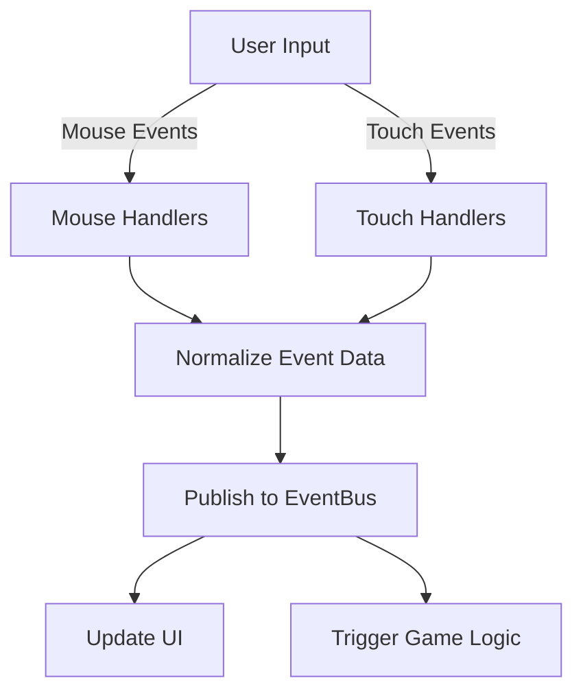

# InputManager Module

The InputManager module provides unified input handling for both mouse and touch interactions, ensuring consistent drag-and-drop behavior across different devices.

## Purpose and Functionality

The InputManager module serves these key purposes:

1. **Cross-Device Support**: Handles both mouse and touch interactions
2. **Unified API**: Normalizes different input types into consistent events
3. **Visual Feedback**: Provides rich visual feedback during interactions
4. **Event Abstraction**: Converts DOM events into application events
5. **Enhanced Mobile Experience**: Optimizes interaction for touch devices

## Implementation Details

The InputManager module uses the Module Pattern with event-driven communication:

```javascript
/**
 * InputManager Module for Word Scramble Game
 * Unified handling of mouse and touch interactions
 */
const InputManager = (function() {
    // Private state
    let _draggingItem = null;
    let _dragTileClone = null;
    let _originalPosition = null;
    let _isTouchDevice = false;
    
    // DOM elements
    let _dropArea = null;
    let _scrambledWordArea = null;
    
    // Private methods
    
    /**
     * Detect if device supports touch
     * @returns {boolean} Whether device supports touch
     */
    function _detectTouchSupport() {
        return 'ontouchstart' in window || 
               navigator.maxTouchPoints > 0 || 
               navigator.msMaxTouchPoints > 0;
    }
    
    /**
     * Handle start of drag operation (mouse)
     * @param {DragEvent} e - Drag start event
     */
    function _handleDragStart(e) {
        _draggingItem = e.target;
        e.dataTransfer.setData('text/plain', e.target.id);
        e.target.classList.add('dragging');
        
        // Record original position
        _originalPosition = {
            parent: e.target.parentElement,
            nextSibling: e.target.nextElementSibling
        };
        
        // Create a better drag image
        const dragImage = e.target.cloneNode(true);
        dragImage.style.width = '50px';
        dragImage.style.height = '50px';
        dragImage.style.opacity = '0.9';
        dragImage.style.position = 'absolute';
        dragImage.style.top = '-1000px';
        document.body.appendChild(dragImage);
        
        // Set custom drag image
        e.dataTransfer.setDragImage(dragImage, 25, 25);
        
        // Remove temporary element after delay
        setTimeout(() => {
            document.body.removeChild(dragImage);
        }, 0);
        
        // Play drag sound
        window.AudioService.playSound('drag');
        
        // Publish drag start event
        window.EventBus.publish('dragStart', {
            element: e.target,
            id: e.target.id,
            sourceContainer: e.target.closest('.letter-box') ? 'letter-box' : 'scrambled-word'
        });
    }
    
    /**
     * Handle end of drag operation (mouse)
     * @param {DragEvent} e - Drag end event
     */
    function _handleDragEnd(e) {
        e.target.classList.remove('dragging');
        _draggingItem = null;
        
        // Publish drag end event
        window.EventBus.publish('dragEnd', {
            element: e.target,
            id: e.target.id
        });
    }
    
    /**
     * Handle touch start event
     * @param {TouchEvent} e - Touch start event
     */
    function _handleTouchStart(e) {
        // Prevent default to avoid scrolling while dragging
        e.preventDefault();
        
        const touch = e.touches[0];
        const target = document.elementFromPoint(touch.clientX, touch.clientY);
        
        if (!target || !target.classList.contains('letter-tile')) return;
        
        _draggingItem = target;
        _draggingItem.classList.add('dragging');
        
        // Save original position for reference
        _originalPosition = {
            parent: _draggingItem.parentElement,
            nextSibling: _draggingItem.nextElementSibling
        };
        
        // Get touch position
        const startX = touch.clientX;
        const startY = touch.clientY;
        
        // Calculate offset from the tile center for more accurate positioning
        const rect = _draggingItem.getBoundingClientRect();
        const offsetX = startX - (rect.left + rect.width / 2);
        const offsetY = startY - (rect.top + rect.height / 2);
        
        // Create a clone for visual feedback
        _dragTileClone = _draggingItem.cloneNode(true);
        _dragTileClone.classList.add('touch-clone');
        _dragTileClone.style.width = `${rect.width}px`;
        _dragTileClone.style.height = `${rect.height}px`;
        
        // Position at the touch point
        _positionCloneAtTouch(touch);
        
        document.body.appendChild(_dragTileClone);
        
        // Make the original semi-transparent to indicate it's being dragged
        _draggingItem.style.opacity = '0.4';
        
        // Play drag sound
        window.AudioService.playSound('drag');
        
        // Publish touch drag start event
        window.EventBus.publish('touchDragStart', {
            element: _draggingItem,
            id: _draggingItem.id,
            touch: {
                clientX: touch.clientX,
                clientY: touch.clientY
            },
            sourceContainer: _draggingItem.closest('.letter-box') ? 'letter-box' : 'scrambled-word'
        });
    }
    
    /**
     * Position the clone at the touch position
     * @param {Touch} touch - The touch object
     */
    function _positionCloneAtTouch(touch) {
        if (!_dragTileClone) return;
        
        // Center the clone at the touch point
        _dragTileClone.style.left = (touch.clientX - _dragTileClone.offsetWidth/2) + 'px';
        _dragTileClone.style.top = (touch.clientY - _dragTileClone.offsetHeight/2) + 'px';
    }
    
    // Additional methods omitted for brevity...
    
    // Public API
    return {
        /**
         * Initialize input manager
         * @returns {Object} InputManager for chaining
         */
        init: function() {
            // Get DOM elements
            _dropArea = document.getElementById('drop-area');
            _scrambledWordArea = document.getElementById('scrambled-word');
            
            // Check for touch support
            _isTouchDevice = _detectTouchSupport();
            
            // Add touch styles if this is a touch device
            if (_isTouchDevice) {
                _addTouchStyles();
            }
            
            // Apply input handlers to existing letter tiles
            document.querySelectorAll('.letter-tile').forEach(tile => {
                _setupMouseDragHandlers(tile);
                _setupTouchHandlers(tile);
            });
            
            // Set up drop area listeners
            this.setupDropAreaListeners();
            
            // Set up mutation observer to watch for new letter tiles
            _setupMutationObserver();
            
            return this;
        },
        
        /**
         * Set up drop area listeners
         * @returns {Object} InputManager for chaining
         */
        setupDropAreaListeners: function() {
            if (!_dropArea || !_scrambledWordArea) return this;
            
            // Set up drop area event listeners
            _dropArea.addEventListener('dragover', e => e.preventDefault());
            _dropArea.addEventListener('drop', e => {
                e.preventDefault();
                
                // Get data and elements
                const id = e.dataTransfer.getData('text/plain');
                const draggedElement = document.getElementById(id);
                
                if (!draggedElement) return;
                
                // Find the first empty letter box
                const emptyBox = _dropArea.querySelector('.letter-box:empty');
                if (emptyBox) {
                    // Create a clone of the dragged tile
                    const clone = draggedElement.cloneNode(true);
                    
                    // Set up drag handlers on the clone
                    _setupMouseDragHandlers(clone);
                    _setupTouchHandlers(clone);
                    
                    // Add to target and remove original
                    emptyBox.appendChild(clone);
                    draggedElement.remove();
                    
                    // Play sound
                    window.AudioService.playSound('drag');
                    
                    // Check if answer is complete
                    _checkAnswer();
                }
            });
            
            // Set up scrambled word area event listeners
            _scrambledWordArea.addEventListener('dragover', e => e.preventDefault());
            _scrambledWordArea.addEventListener('drop', e => {
                e.preventDefault();
                
                // Get data and elements
                const id = e.dataTransfer.getData('text/plain');
                const draggedElement = document.getElementById(id);
                
                if (!draggedElement) return;
                
                // Only process if coming from drop area letter box
                const sourceContainer = e.dataTransfer.getData('source-container');
                if (sourceContainer === 'letter-box') {
                    // Add to scrambled word area
                    _scrambledWordArea.appendChild(draggedElement);
                    
                    // Play sound
                    window.AudioService.playSound('drag');
                }
            });
            
            return this;
        },
        
        /**
         * Check if the device supports touch
         * @returns {boolean} Whether the device supports touch
         */
        isTouchDevice: function() {
            return _isTouchDevice;
        }
    };
})();

// Export the module
window.InputManager = InputManager;
```

## Key Functions

The module exposes three primary functions:

### init()

Initializes the input manager, setting up event handlers and detecting device capabilities.

**Returns**: The InputManager object for method chaining

**Example**:
```javascript
// Initialize the input manager
InputManager.init();
```

### setupDropAreaListeners()

Sets up event listeners for the drop areas (letter box area and scrambled word area).

**Returns**: The InputManager object for method chaining

**Example**:
```javascript
// Set up drop area listeners
InputManager.setupDropAreaListeners();
```

### isTouchDevice()

Checks if the current device supports touch input.

**Returns**: boolean - Whether the device supports touch

**Example**:
```javascript
// Check for touch support
if (InputManager.isTouchDevice()) {
    // Enable touch-specific features
}
```

## Input Handling Features

### Device Detection

The module automatically detects touch support:

```javascript
function _detectTouchSupport() {
    return 'ontouchstart' in window || 
           navigator.maxTouchPoints > 0 || 
           navigator.msMaxTouchPoints > 0;
}
```

This ensures appropriate input handlers are used based on the device's capabilities.

### Drag and Drop Handling

The module provides comprehensive drag and drop support:

1. **Mouse Drag and Drop**: Uses the HTML5 Drag and Drop API
2. **Touch Drag and Drop**: Implements custom touch-based drag and drop
3. **Visual Feedback**: Shows drag clones, highlights drop targets

### Custom Drag Images

For better usability, the module creates custom drag images:

```javascript
// Create a better drag image
const dragImage = e.target.cloneNode(true);
dragImage.style.width = '50px';
dragImage.style.height = '50px';
dragImage.style.opacity = '0.9';
dragImage.style.position = 'absolute';
dragImage.style.top = '-1000px';
document.body.appendChild(dragImage);

// Set custom drag image
e.dataTransfer.setDragImage(dragImage, 25, 25);
```

### Dynamic Element Observation

The module uses MutationObserver to automatically apply input handlers to new elements:

```javascript
function _setupMutationObserver() {
    const observer = new MutationObserver(mutations => {
        mutations.forEach(mutation => {
            if (mutation.type === 'childList') {
                mutation.addedNodes.forEach(node => {
                    if (node.nodeType === 1 && node.classList.contains('letter-tile')) {
                        _setupMouseDragHandlers(node);
                        _setupTouchHandlers(node);
                    }
                });
            }
        });
    });
    
    // Observe both drop area and scrambled word area
    observer.observe(_dropArea, { childList: true, subtree: true });
    observer.observe(_scrambledWordArea, { childList: true, subtree: true });
}
```

This ensures that dynamically created elements have proper input handling.

## Touch Input Handling

For touch devices, the module implements custom drag and drop:

### Touch Start

```javascript
function _handleTouchStart(e) {
    e.preventDefault(); // Prevent scrolling
    
    // Identify target element
    const touch = e.touches[0];
    const target = document.elementFromPoint(touch.clientX, touch.clientY);
    
    // Only handle letter tiles
    if (!target || !target.classList.contains('letter-tile')) return;
    
    // Save state and create visual elements
    _draggingItem = target;
    _originalPosition = {
        parent: target.parentElement,
        nextSibling: target.nextElementSibling
    };
    
    // Create visual clone for dragging
    _createDragClone(target, touch);
    
    // Publish event
    window.EventBus.publish('touchDragStart', {
        element: target,
        id: target.id
    });
}
```

### Touch Move

```javascript
function _handleTouchMove(e) {
    if (!_draggingItem || !_dragTileClone) return;
    
    e.preventDefault(); // Prevent scrolling
    
    const touch = e.touches[0];
    
    // Move clone with finger
    _positionCloneAtTouch(touch);
    
    // Identify potential drop targets
    const elementUnderTouch = document.elementFromPoint(touch.clientX, touch.clientY);
    const dropTarget = _findDropTarget(elementUnderTouch);
    
    // Highlight drop target
    _highlightDropTarget(dropTarget);
}
```

### Touch End

```javascript
function _handleTouchEnd(e) {
    if (!_draggingItem || !_dragTileClone) return;
    
    e.preventDefault();
    
    const touch = e.changedTouches[0];
    
    // Find drop target
    const elementUnderTouch = document.elementFromPoint(touch.clientX, touch.clientY);
    const dropTarget = _findDropTarget(elementUnderTouch);
    
    if (dropTarget) {
        // Handle drop based on target type
        if (dropTarget.classList.contains('letter-box')) {
            _handleDropInLetterBox(dropTarget);
        } else if (dropTarget.id === 'scrambled-word') {
            _handleDropInScrambledArea(dropTarget);
        }
    } else {
        // Return to original position if no valid target
        _returnToOriginalPosition();
    }
    
    // Clean up
    _cleanupDrag();
}
```

## Input Event Flow

The module handles input through this flow:



## Mobile-Specific Optimizations

The module includes several mobile-specific optimizations:

### Touch Styles

```javascript
function _addTouchStyles() {
    const style = document.createElement('style');
    style.id = 'touch-drag-styles';
    style.textContent = `
        .letter-tile {
            -webkit-touch-callout: none;
            -webkit-user-select: none;
            -webkit-tap-highlight-color: transparent;
            touch-action: none;
        }
        
        .touch-clone {
            position: fixed;
            z-index: 9999;
            opacity: 0.8;
            pointer-events: none;
            transition: none;
            box-shadow: 0 5px 15px rgba(0, 0, 0, 0.3);
        }
        
        .letter-box.drag-highlight {
            background-color: rgba(142, 68, 173, 0.2);
            border: 2px solid #8e44ad;
            transform: scale(1.1);
        }
    `;
    document.head.appendChild(style);
}
```

### Preventing Default Behaviors

```javascript
// Prevent scrolling and other default touch behaviors
e.preventDefault();
```

### Touch Target Size

Ensuring touch targets are large enough for comfortable interaction (at least 44x44 pixels).

## Integration with Other Modules

The InputManager integrates with:

1. **EventBus**: Publishes input events
2. **AudioService**: Plays sound effects during drag operations
3. **DragDropManager**: Shares responsibility for drag and drop
4. **GameController**: Indirectly triggers game logic through events

## Published Events

The module publishes these events:

| Event | Description | Data |
|-------|-------------|------|
| `dragStart` | Drag operation started | `{element, id, sourceContainer}` |
| `dragEnd` | Drag operation ended | `{element, id}` |
| `touchDragStart` | Touch drag started | `{element, id, touch, sourceContainer}` |
| `touchDragMove` | Touch drag moved | `{element, id, touch, dropTarget}` |
| `touchDragEnd` | Touch drag ended | `{success, target}` |
| `allLettersPlaced` | All letter boxes are filled | `null` |

## Browser Support

The module supports these browsers:

- Chrome 58+
- Firefox 55+
- Safari 11+
- Edge 15+
- Mobile Safari 11+
- Chrome for Android 58+

## Usage Patterns

### Setting Up Input Handlers

```javascript
// Initialize input handling
function initializeGame() {
    // Initialize input manager
    InputManager.init();
    
    // Set up button event listeners
    document.getElementById('hint-btn').addEventListener('click', function() {
        EventBus.publish('hintButtonClicked', null);
    });
    
    document.getElementById('next-btn').addEventListener('click', function() {
        EventBus.publish('nextButtonClicked', null);
    });
}
```

### Responding to Input Events

```javascript
// Subscribe to input events
EventBus.subscribe('dragStart', function(data) {
    console.log('Drag started:', data.id);
});

EventBus.subscribe('allLettersPlaced', function() {
    // Check answer when all letters are placed
    checkAnswer();
});
```

### Conditional Input Logic

```javascript
// Apply different logic based on device type
function setupInputHandlers() {
    // Base handlers for all devices
    setupBasicHandlers();
    
    // Add touch-specific enhancements for touch devices
    if (InputManager.isTouchDevice()) {
        setupTouchEnhancements();
    }
}
```

## Common Challenges and Solutions

### Challenge: Scroll vs. Drag

On mobile devices, distinguishing between scrolling and dragging can be difficult.

**Solution**: Use a small movement threshold before initiating drag:

```javascript
function handleTouchMove(e) {
    if (!isDragging && !hasMoved) {
        const deltaX = Math.abs(e.touches[0].clientX - startX);
        const deltaY = Math.abs(e.touches[0].clientY - startY);
        
        // If movement is significant, start dragging
        if (deltaX > 10 || deltaY > 10) {
            hasMoved = true;
            
            // If more horizontal than vertical, start drag
            if (deltaX > deltaY) {
                e.preventDefault();
                isDragging = true;
                startDrag(e);
            }
            // Otherwise allow normal scrolling
        }
    }
    
    if (isDragging) {
        e.preventDefault();
        continueDrag(e);
    }
}
```

### Challenge: Touch Precision

Touch inputs are less precise than mouse inputs.

**Solution**: Implement snap-to-target behavior and larger drop zones:

```javascript
function findNearestDropTarget(x, y) {
    // Get all possible drop targets
    const targets = document.querySelectorAll('.letter-box:empty');
    
    // Find the nearest one
    let nearest = null;
    let minDistance = Infinity;
    
    targets.forEach(target => {
        const rect = target.getBoundingClientRect();
        const centerX = rect.left + rect.width / 2;
        const centerY = rect.top + rect.height / 2;
        
        const distance = Math.hypot(centerX - x, centerY - y);
        
        if (distance < minDistance) {
            minDistance = distance;
            nearest = target;
        }
    });
    
    // Only snap if within reasonable distance (e.g., 50px)
    if (minDistance < 50) {
        return nearest;
    }
    
    return null;
}
```

### Challenge: Inconsistent Browser Implementation

Different browsers implement the Drag and Drop API inconsistently.

**Solution**: Add browser detection and fallbacks:

```javascript
function setupDragAndDrop() {
    // Check for drag and drop support
    const supportsHTML5DnD = 'draggable' in document.createElement('div');
    
    if (supportsHTML5DnD) {
        setupStandardDragAndDrop();
    } else {
        setupCustomDragAndDrop();
    }
}
```

### Challenge: Performance on Mobile

Touch move events can fire rapidly, causing performance issues.

**Solution**: Throttle events to improve performance:

```javascript
// Throttle function to limit execution rate
function throttle(func, limit) {
    let inThrottle;
    return function(...args) {
        if (!inThrottle) {
            func.apply(this, args);
            inThrottle = true;
            setTimeout(() => inThrottle = false, limit);
        }
    };
}

// Throttled touch move handler
const throttledTouchMove = throttle(_handleTouchMove, 16); // ~60fps
element.addEventListener('touchmove', throttledTouchMove);
```

## Best Practices

### 1. Input Abstraction

Abstract input differences to provide a consistent API:

```javascript
// Good: Unified input handler
function setupDragHandlers(element) {
    // Mouse events
    element.addEventListener('mousedown', handleDragStart);
    
    // Touch events
    element.addEventListener('touchstart', handleDragStart);
    
    // Single handler for both inputs
    function handleDragStart(e) {
        // Normalize the event data
        const inputData = normalizeInputEvent(e);
        startDrag(inputData);
    }
}

// Normalize different event types
function normalizeInputEvent(e) {
    if (e.type.startsWith('touch')) {
        const touch = e.touches[0];
        return {
            clientX: touch.clientX,
            clientY: touch.clientY,
            target: document.elementFromPoint(touch.clientX, touch.clientY) || e.target,
            originalEvent: e
        };
    } else {
        return {
            clientX: e.clientX,
            clientY: e.clientY,
            target: e.target,
            originalEvent: e
        };
    }
}
```

### 2. Visual Feedback

Provide clear visual feedback for all interactions:

```javascript
function provideDragFeedback(element, isDragging) {
    if (isDragging) {
        // Visual cues for active dragging
        element.classList.add('dragging');
        element.style.opacity = '0.7';
        
        // Optional vibration feedback on supported devices
        if ('vibrate' in navigator) {
            navigator.vibrate(30); // Short vibration
        }
    } else {
        // Reset visual state
        element.classList.remove('dragging');
        element.style.opacity = '1';
    }
}
```

### 3. Error Recovery

Implement error recovery for failed interactions:

```javascript
function handleDragError() {
    // Return dragged item to original position
    if (_draggingItem && _originalPosition) {
        if (_originalPosition.nextSibling) {
            _originalPosition.parent.insertBefore(_draggingItem, _originalPosition.nextSibling);
        } else {
            _originalPosition.parent.appendChild(_draggingItem);
        }
    }
    
    // Clean up drag state
    _cleanupDragState();
    
    // Play error sound
    window.AudioService.playSound('error');
}
```

### 4. Accessibility

Add keyboard navigation for accessibility:

```javascript
function setupKeyboardNavigation() {
    // Track currently focused letter
    let focusedLetterIndex = -1;
    const letterTiles = document.querySelectorAll('.letter-tile');
    
    // Make letter tiles focusable
    letterTiles.forEach(tile => {
        tile.setAttribute('tabindex', '0');
    });
    
    // Add keyboard handlers
    document.addEventListener('keydown', function(e) {
        switch (e.key) {
            case 'ArrowRight':
                // Move focus to next letter
                focusedLetterIndex = Math.min(focusedLetterIndex + 1, letterTiles.length - 1);
                letterTiles[focusedLetterIndex].focus();
                break;
                
            case 'ArrowLeft':
                // Move focus to previous letter
                focusedLetterIndex = Math.max(focusedLetterIndex - 1, 0);
                letterTiles[focusedLetterIndex].focus();
                break;
                
            case 'Enter':
            case ' ':
                // Select focused letter
                if (focusedLetterIndex >= 0) {
                    selectLetter(letterTiles[focusedLetterIndex]);
                }
                break;
        }
    });
}
```

## Performance Optimizations

### 1. Event Delegation

Use event delegation to reduce the number of event listeners:

```javascript
// Instead of attaching listeners to each element
function setupEfficientListeners() {
    // Single listener on parent element
    document.getElementById('scrambled-word').addEventListener('mousedown', function(e) {
        // Check if target is a letter tile
        if (e.target.classList.contains('letter-tile')) {
            handleDragStart(e);
        }
    });
}
```

### 2. Passive Event Listeners

Use passive event listeners where appropriate:

```javascript
// Use passive listener for events that don't call preventDefault()
element.addEventListener('touchstart', handleTouchStart, { passive: true });
```

### 3. DOM Caching

Cache DOM elements instead of repeatedly querying them:

```javascript
// Cache DOM elements on initialization
function init() {
    _elements = {
        dropArea: document.getElementById('drop-area'),
        scrambledWord: document.getElementById('scrambled-word'),
        letterTiles: document.querySelectorAll('.letter-tile'),
        letterBoxes: document.querySelectorAll('.letter-box')
    };
}
```

### 4. Debounced Update Checks

Debounce answer checking to avoid excessive processing:

```javascript
// Debounce function
function debounce(func, wait) {
    let timeout;
    return function(...args) {
        clearTimeout(timeout);
        timeout = setTimeout(() => func.apply(this, args), wait);
    };
}

// Debounced answer check
const debouncedCheckAnswer = debounce(() => {
    if (_isAllLettersPlaced()) {
        EventBus.publish('allLettersPlaced', null);
    }
}, 250);
```

## Extension Points

The InputManager can be extended with additional functionality:

### 1. Supporting Additional Input Types

Add support for additional input methods like stylus or gamepad:

```javascript
// Add stylus support
function setupStylusSupport() {
    document.addEventListener('pointerdown', function(e) {
        if (e.pointerType === 'pen') {
            handleStylusStart(e);
        }
    });
}
```

### 2. Gesture Recognition

Add support for gestures like pinch, swipe, or long press:

```javascript
// Detect swipe gesture
function detectSwipe(startX, startY, endX, endY) {
    const deltaX = endX - startX;
    const deltaY = endY - startY;
    const distance = Math.sqrt(deltaX * deltaX + deltaY * deltaY);
    
    if (distance > 50) { // Minimum swipe distance
        // Determine direction
        if (Math.abs(deltaX) > Math.abs(deltaY)) {
            return deltaX > 0 ? 'right' : 'left';
        } else {
            return deltaY > 0 ? 'down' : 'up';
        }
    }
    
    return null;
}
```

### 3. Multi-Touch Support

Add support for multi-touch interactions:

```javascript
// Track multiple touches
const activeTouches = {};

function handleMultiTouchStart(e) {
    // Store all active touches
    for (let i = 0; i < e.changedTouches.length; i++) {
        const touch = e.changedTouches[i];
        activeTouches[touch.identifier] = {
            startX: touch.clientX,
            startY: touch.clientY,
            currentX: touch.clientX,
            currentY: touch.clientY
        };
    }
    
    // If exactly two touches, might be a pinch/zoom
    if (Object.keys(activeTouches).length === 2) {
        startPinchGesture();
    }
}
```

## Conclusion

The InputManager module provides a comprehensive solution for handling user input across different devices and input methods. By abstracting the differences between mouse and touch interactions, it ensures a consistent and responsive user experience regardless of the device being used.

The module's event-driven architecture, integration with the EventBus, and attention to performance and accessibility make it a key component in the Word Scramble Game's cross-platform capabilities.

When extending the InputManager, focus on maintaining the unified input API while adding support for new input methods or gesture types. This approach ensures that the game remains accessible and enjoyable across an ever-expanding range of devices and interaction methods.