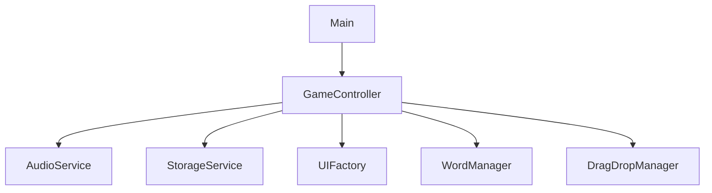

# Main Module

The Main Module serves as the entry point for the Word Scramble Game application.

## Purpose

This module has a single responsibility:
- Initialize the game when the DOM is fully loaded
- Provide error handling for the initialization process

## Implementation

The Main Module is implemented in `main.js` using a simple event listener pattern:

```javascript
/**
 * Main entry point for Word Scramble Game
 * Initializes all modules and starts the game
 */
document.addEventListener('DOMContentLoaded', () => {
    console.log('Initializing Word Scramble Game...');
    
    try {
        // Initialize game controller (which initializes other modules)
        GameController.init();
        console.log('Game initialization complete!');
    } catch (error) {
        console.error('Error initializing game:', error);
    }
});
```

## Initialization Flow

The initialization flow is simple but effective:

1. Wait for the DOM content to be fully loaded
2. Log the initialization start
3. Try to initialize the Game Controller
   - The Game Controller then initializes all other modules
4. Log completion or errors as appropriate

## Error Handling

The Main Module implements basic error handling by wrapping the initialization in a try-catch block. This ensures that any errors during initialization are:

1. Caught safely without crashing the application
2. Logged to the console for debugging
3. Handled gracefully

## Dependency Graph

The Main Module sits at the top of the dependency graph:



As shown above, the Main Module only directly depends on the Game Controller, which in turn manages all other dependencies.

## Extension Points

The Main Module is intentionally kept simple and focused, but it can be extended in several ways:

### Multiple Game Modes

To support multiple game modes, the Main Module could be extended to initialize different controllers based on user selection:

```javascript
document.addEventListener('DOMContentLoaded', () => {
    console.log('Initializing Word Scramble Game...');
    
    try {
        // Determine which game mode to initialize
        const gameMode = localStorage.getItem('preferredGameMode') || 'standard';
        
        // Initialize the appropriate controller
        switch (gameMode) {
            case 'timeAttack':
                TimeAttackController.init();
                break;
            case 'multiPlayer':
                MultiPlayerController.init();
                break;
            case 'standard':
            default:
                GameController.init();
                break;
        }
        
        console.log(`${gameMode} game mode initialized successfully!`);
    } catch (error) {
        console.error('Error initializing game:', error);
    }
});
```

### Initialization Options

The Main Module could also be extended to support initialization options:

```javascript
document.addEventListener('DOMContentLoaded', () => {
    console.log('Initializing Word Scramble Game...');
    
    try {
        // Get initialization options
        const options = {
            difficulty: localStorage.getItem('difficulty') || 'normal',
            soundEnabled: localStorage.getItem('soundEnabled') !== 'false',
            language: localStorage.getItem('language') || 'en',
            // ... other options ...
        };
        
        // Initialize game controller with options
        GameController.init(options);
        console.log('Game initialization complete!');
    } catch (error) {
        console.error('Error initializing game:', error);
    }
});
```

## Best Practices

When modifying the Main Module, keep these best practices in mind:

1. **Keep It Simple**: The Main Module should remain focused on initialization
2. **Proper Error Handling**: Always maintain the try-catch pattern for robustness
3. **Logging**: Maintain informative logging for debugging
4. **Asynchronous Initialization**: If adding asynchronous initialization steps, use async/await or promises appropriately

## Conclusion

The Main Module provides a clean, simple entry point for the Word Scramble Game. Its focused responsibility allows other modules to handle their specific concerns while ensuring the application starts correctly.