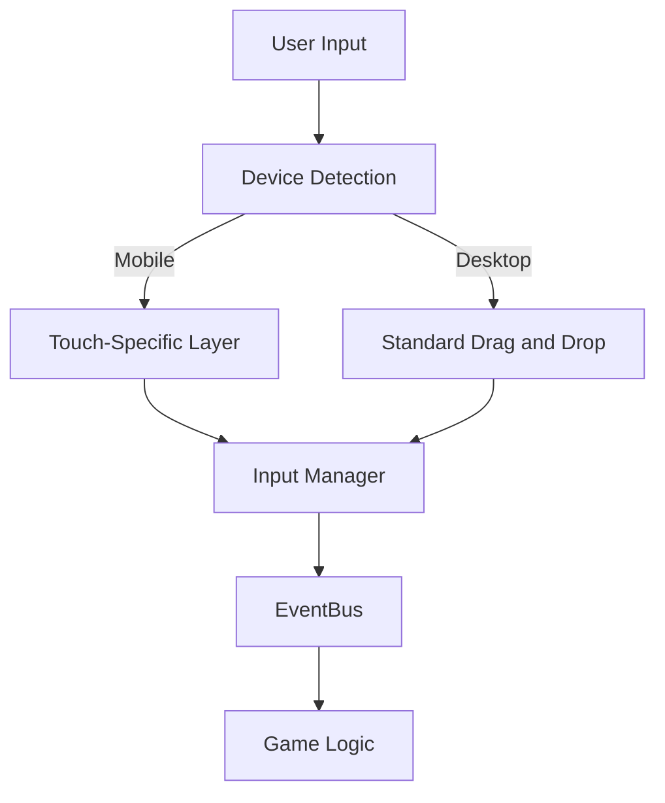
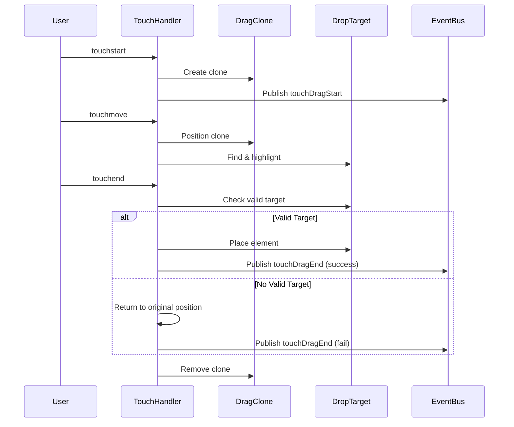

# Mobile Support Implementation

The Word Scramble Game includes comprehensive support for mobile devices. This document details the mobile-specific implementations that ensure a consistent, high-quality experience across different device types.

## Mobile Support Architecture

The mobile support architecture follows a layered approach:



This architecture enables the game to provide appropriate interaction methods based on the device capabilities while maintaining consistent behavior.

## Device Detection

The game uses feature detection to identify touch-capable devices:

```javascript
function _detectTouchSupport() {
    return 'ontouchstart' in window || 
           navigator.maxTouchPoints > 0 || 
           navigator.msMaxTouchPoints > 0;
}

// In InputManager init method
_isTouchDevice = _detectTouchSupport();

if (_isTouchDevice) {
    _addTouchStyles();
    _setupTouchHandlers();
}
```

This approach is more reliable than user agent detection, as it detects the actual device capabilities rather than attempting to identify specific devices or browsers.

## Touch-Specific Components

### TouchDragManager Module

The game includes a specialized `TouchDragManager` module for touch devices:

```javascript
/**
 * Enhanced Touch Support for Word Scramble Game with Fixes
 */
const TouchDragManager = (function() {
    // Track touch state
    let isDragging = false;
    let currentDragTile = null;
    let dragTileClone = null;
    let startX, startY;
    let offsetX, offsetY;
    let originalPosition = null;
    
    // DOM elements
    let dropArea = null;
    let scrambledWordArea = null;
    
    /**
     * Initialize touch support for all draggable elements
     */
    function init() {
        // Get the main game areas
        dropArea = document.getElementById('drop-area');
        scrambledWordArea = document.getElementById('scrambled-word');
        
        // Apply touch handlers to existing letter tiles
        applyTouchHandlersToAllTiles();
        
        // Set up a mutation observer to watch for new letter tiles
        setupMutationObserver();
        
        // Add specific touch styles
        addTouchStyles();
        
        // Subscribe to wordLoaded event to apply touch handlers to new tiles
        if (window.EventBus) {
            window.EventBus.subscribe('wordLoaded', () => {
                // Small delay to ensure DOM is updated
                setTimeout(() => {
                    applyTouchHandlersToAllTiles();
                }, 100);
            });
        }
        
        console.log('TouchDragManager initialized');
    }
    
    // Additional methods for touch handling...
    
    return {
        init: init,
        setupTouchHandlers: setupTouchHandlers,
        applyTouchHandlersToAllTiles: applyTouchHandlersToAllTiles
    };
})();
```

This module specializes in providing a high-quality drag-and-drop experience specifically for touch devices.

## Touch Event Handling

### Touch Start Handling

```javascript
function handleTouchStart(e) {
    // Prevent default to avoid scrolling while dragging
    e.preventDefault();
    
    currentDragTile = this;
    currentDragTile.classList.add('dragging');
    
    // Save original position for reference
    originalPosition = {
        parent: currentDragTile.parentElement,
        nextSibling: currentDragTile.nextElementSibling
    };
    
    // Get touch position
    const touch = e.touches[0];
    startX = touch.clientX;
    startY = touch.clientY;
    
    // Calculate offset from the tile center for more accurate positioning
    const rect = currentDragTile.getBoundingClientRect();
    offsetX = startX - (rect.left + rect.width / 2);
    offsetY = startY - (rect.top + rect.height / 2);
    
    // Create a clone for visual feedback
    dragTileClone = currentDragTile.cloneNode(true);
    dragTileClone.classList.add('touch-clone');
    dragTileClone.style.width = `${rect.width}px`;
    dragTileClone.style.height = `${rect.height}px`;
    
    // Position at the touch point
    positionCloneAtTouch(touch);
    
    document.body.appendChild(dragTileClone);
    
    // Make the original semi-transparent to indicate it's being dragged
    currentDragTile.style.opacity = '0.4';
    
    // Play drag sound
    if (window.AudioService) {
        window.AudioService.playSound('drag');
    }
    
    // Indicate dragging has started
    isDragging = true;
    
    // Publish event if EventBus is available
    if (window.EventBus) {
        window.EventBus.publish('touchDragStart', {
            element: currentDragTile,
            letter: currentDragTile.textContent,
            sourceContainer: currentDragTile.closest('.letter-box') ? 'letter-box' : 'scrambled-word'
        });
    }
}
```

### Touch Move Handling

```javascript
function handleTouchMove(e) {
    if (!isDragging) return;
    
    e.preventDefault(); // Prevent scrolling
    
    const touch = e.touches[0];
    
    // Move the clone with the touch
    positionCloneAtTouch(touch);
    
    // Identify potential drop targets
    const elementUnderTouch = document.elementFromPoint(touch.clientX, touch.clientY);
    
    // Remove highlight from all potential drop targets
    document.querySelectorAll('.drag-over, .drag-highlight').forEach(el => {
        el.classList.remove('drag-over');
        el.classList.remove('drag-highlight');
    });
    
    // Highlight the potential drop target
    const dropTarget = findDropTarget(elementUnderTouch);
    if (dropTarget) {
        dropTarget.classList.add('drag-highlight');
    }
}
```

### Touch End Handling

```javascript
function handleTouchEnd(e) {
    if (!isDragging) return;
    
    e.preventDefault(); // Prevent default behavior
    
    // Get the position of the last touch
    const touch = e.changedTouches[0];
    
    // Find the element under the touch
    const elementUnderTouch = document.elementFromPoint(touch.clientX, touch.clientY);
    
    // Find potential drop target
    const dropTarget = findDropTarget(elementUnderTouch);
    
    // Reset original tile opacity
    if (currentDragTile) {
        currentDragTile.style.opacity = '1';
    }
    
    // Handle the drop
    if (dropTarget) {
        dropTarget.classList.remove('drag-highlight');
        
        // Handle drop in letter box
        if (dropTarget.classList.contains('letter-box')) {
            handleDropInLetterBox(dropTarget);
        } 
        // Handle drop back in scrambled word area
        else if (dropTarget.id === 'scrambled-word' || dropTarget.closest('#scrambled-word')) {
            handleDropInScrambledArea(scrambledWordArea, touch);
        }
    } else {
        // If no valid target, return to original position
        returnToOriginalPosition();
    }
    
    // Clean up
    cleanupDrag();
    
    // Publish event if EventBus is available
    if (window.EventBus) {
        window.EventBus.publish('touchDragEnd', {
            success: !!dropTarget,
            target: dropTarget ? dropTarget.id : null
        });
    }
}
```

## Visual Feedback for Touch

The game provides rich visual feedback specifically for touch interactions:

### Touch-Specific Styles

```javascript
function addTouchStyles() {
    if (!document.getElementById('touch-drag-styles')) {
        const style = document.createElement('style');
        style.id = 'touch-drag-styles';
        style.textContent = `
            .letter-tile {
                -webkit-touch-callout: none;
                -webkit-user-select: none;
                -webkit-tap-highlight-color: transparent;
                touch-action: none;
            }
            
            .touch-clone {
                position: fixed;
                z-index: 9999;
                opacity: 0.8;
                pointer-events: none;
                transition: none;
                box-shadow: 0 5px 15px rgba(0, 0, 0, 0.3);
            }
            
            .letter-box.drag-highlight {
                background-color: rgba(142, 68, 173, 0.2);
                border: 2px solid #8e44ad;
                transform: scale(1.1);
            }
        `;
        document.head.appendChild(style);
    }
}
```

### Visual Drag Clone

During touch dragging, a clone of the dragged element follows the user's finger:

```javascript
function positionCloneAtTouch(touch) {
    if (!dragTileClone) return;
    
    // Center the clone at the touch point
    dragTileClone.style.left = (touch.clientX - dragTileClone.offsetWidth/2) + 'px';
    dragTileClone.style.top = (touch.clientY - dragTileClone.offsetHeight/2) + 'px';
}
```

### Drop Target Highlighting

When dragging over potential drop targets, they are highlighted to indicate where the item can be dropped:

```javascript
function highlightDropTarget(target) {
    // Remove existing highlights
    document.querySelectorAll('.drag-highlight').forEach(el => {
        el.classList.remove('drag-highlight');
    });
    
    // Add highlight to new target
    if (target) {
        target.classList.add('drag-highlight');
    }
}
```

## Responsive UI Design

In addition to touch event handling, the game includes responsive design for different screen sizes:

### Responsive CSS Media Queries

```css
/* Base styles for large screens */
.letter-box {
    width: 50px;
    height: 50px;
    margin: 5px;
}

.letter-tile {
    width: 52px;
    height: 52px;
    font-size: 1.6rem;
    margin: 6px;
}

/* Styles for medium screens */
@media (max-width: 767px) {
    .letter-box {
        width: 40px;
        height: 40px;
        margin: 3px;
        border-width: 1px;
    }
    
    .letter-tile {
        width: 40px;
        height: 40px;
        font-size: 1.3rem;
        margin: 3px;
    }
    
    /* More compact layout */
    .drop-area {
        gap: 5px;
        margin: 10px 0;
    }
}

/* Styles for small screens */
@media (max-width: 375px) {
    .letter-box, .letter-tile {
        width: 35px;
        height: 35px;
    }
    
    /* Ultra-compact layout */
    .scrambled-word {
        gap: 3px;
        padding: 8px;
    }
}
```

### Flexible Layout

The game uses flexbox for flexible layouts that adjust to different screen sizes:

```css
.scrambled-word {
    display: flex;
    flex-wrap: wrap;
    justify-content: center;
    gap: 10px;
    margin: 20px 0;
    min-height: 60px;
    padding: 15px;
}

.drop-area {
    display: flex;
    justify-content: center;
    align-items: center;
    flex-wrap: wrap;
    gap: 10px; 
}
```

### Touch-Friendly Button Sizes

Buttons are designed to be touch-friendly on mobile devices:

```css
.game-btn {
    padding: 10px 20px;
    margin: 5px;
    font-size: 1rem;
    min-height: 44px; /* Minimum touch target size */
    min-width: 44px;  /* Minimum touch target size */
}

@media (max-width: 576px) {
    /* Even larger buttons on small screens */
    .buttons-container {
        flex-direction: column;
        gap: 10px;
    }

    .game-btn {
        width: 100%;
        padding: 12px;
        font-size: 0.9rem;
    }
}
```

## Mobile Performance Optimizations

### Event Throttling

Touch events are throttled to improve performance on mobile devices:

```javascript
// Throttle function to limit execution rate
function throttle(func, limit) {
    let inThrottle;
    return function(...args) {
        if (!inThrottle) {
            func.apply(this, args);
            inThrottle = true;
            setTimeout(() => inThrottle = false, limit);
        }
    };
}

// Throttled touch move handler
const throttledTouchMove = throttle(handleTouchMove, 16); // ~60fps
element.addEventListener('touchmove', throttledTouchMove, { passive: false });
```

### Passive Event Listeners

Where appropriate, passive event listeners are used to improve scrolling performance:

```javascript
// Use passive listener for events that don't call preventDefault()
element.addEventListener('touchstart', handleTouchStart, { passive: true });
```

### Optimized Animation

CSS animations are optimized for mobile performance:

```css
.touch-clone {
    /* Use transforms instead of left/top for better performance */
    transform: translate(0, 0);
    /* Use GPU acceleration */
    will-change: transform;
    /* Avoid unnecessary transitions during drag */
    transition: none;
}
```

## Touch vs. Mouse Event Handling Differences

### Difference 1: Drag Visualization

- **Mouse**: Uses the browser's built-in drag image with customization
- **Touch**: Creates and positions a clone element that follows the touch

### Difference 2: Event Types

- **Mouse**: Uses `dragstart`, `dragover`, `dragend`, `drop` events
- **Touch**: Uses `touchstart`, `touchmove`, `touchend` events

### Difference 3: Position Calculation

- **Mouse**: Drop position determined by the browser's drag and drop system
- **Touch**: Manual calculation of position using `document.elementFromPoint()`

### Difference 4: Input Prevention

- **Mouse**: Minimal need to prevent default behaviors
- **Touch**: Must prevent default to avoid scrolling during drag operations

## Touch Event Flow

The flow of touch events follows this sequence:



## Mobile-Specific Challenges and Solutions

### Challenge: Touch Precision

Touch inputs are inherently less precise than mouse inputs.

**Solution**: Implement snap-to-target behavior and larger touch targets:

```javascript
function findNearestDropTarget(x, y) {
    // Get all possible drop targets
    const targets = document.querySelectorAll('.letter-box:empty');
    
    // Find the nearest one
    let nearest = null;
    let minDistance = Infinity;
    
    targets.forEach(target => {
        const rect = target.getBoundingClientRect();
        const centerX = rect.left + rect.width / 2;
        const centerY = rect.top + rect.height / 2;
        
        const distance = Math.hypot(centerX - x, centerY - y);
        
        if (distance < minDistance) {
            minDistance = distance;
            nearest = target;
        }
    });
    
    // Only snap if within reasonable distance (e.g., 50px)
    if (minDistance < 50) {
        return nearest;
    }
    
    return null;
}
```

### Challenge: Scroll vs. Drag

Distinguishing between scrolling intentions and drag operations can be difficult.

**Solution**: Use a threshold before initiating drag:

```javascript
function handleTouchMove(e) {
    if (!isDragging && !hasMoved) {
        const deltaX = Math.abs(e.touches[0].clientX - startX);
        const deltaY = Math.abs(e.touches[0].clientY - startY);
        
        // If movement exceeds threshold, determine if it's a drag or scroll
        if (deltaX > 10 || deltaY > 10) {
            hasMoved = true;
            
            // If more horizontal than vertical movement, treat as drag
            if (deltaX > deltaY) {
                e.preventDefault(); // Prevent scrolling
                isDragging = true;
                startDrag();
            }
            // Otherwise let normal scrolling happen
        }
    }
    
    if (isDragging) {
        e.preventDefault();
        continueDrag(e);
    }
}
```

### Challenge: Visual Feedback

Touch interactions lack the inherent visual feedback of mouse cursors.

**Solution**: Rich visual clues for touch interactions:

```javascript
function provideTouchFeedback(isDragging, dropTarget) {
    // Feedback for dragging state
    if (isDragging) {
        // Show drag clone with shadow
        dragTileClone.style.boxShadow = '0 10px 20px rgba(0,0,0,0.2)';
        
        // Make original semi-transparent
        currentDragTile.style.opacity = '0.4';
        
        // Optional vibration feedback on supported devices
        if (navigator.vibrate && dropTarget) {
            navigator.vibrate(30); // Short pulse
        }
    }
    
    // Feedback for valid drop targets
    if (dropTarget) {
        dropTarget.classList.add('drag-highlight');
        dropTarget.style.transform = 'scale(1.1)';
        dropTarget.style.transition = 'transform 0.2s';
    }
}
```

### Challenge: Device Orientation Changes

Device orientation can change during gameplay.

**Solution**: Respond to orientation changes:

```javascript
window.addEventListener('orientationchange', function() {
    // Wait for orientation change to complete
    setTimeout(() => {
        // Re-layout game elements
        repositionGameElements();
        
        // Cancel any ongoing drag operation
        if (isDragging) {
            cancelDrag();
        }
    }, 300);
});

function repositionGameElements() {
    // Adjust layout based on new orientation
    const isLandscape = window.innerWidth > window.innerHeight;
    
    // Apply different layouts for portrait vs landscape
    if (isLandscape) {
        // Landscape layout adjustments
    } else {
        // Portrait layout adjustments
    }
}
```

## Testing Mobile Support

When testing the mobile support of the Word Scramble Game, focus on these areas:

### Touch Accuracy Testing

Test whether touch interactions accurately place letters:

1. Try dragging letters to different positions
2. Test with different finger positions (fingertip, fingernail, etc.)
3. Verify that letters snap to appropriate drop targets

### Visual Feedback Testing

Ensure visual feedback is clear on mobile devices:

1. Confirm drag clone follows finger accurately
2. Verify drop targets highlight clearly
3. Check that letter placement is visually obvious

### Performance Testing

Test performance on various device types:

1. Test on low-end devices to check performance
2. Verify smooth dragging even with many letter tiles
3. Check that animations don't cause lag or stuttering

### Device Compatibility Testing

Test across different device types:

1. iOS devices (iPhone, iPad)
2. Android devices (different manufacturers)
3. Touchscreen laptops and 2-in-1 devices

## Progressive Web App Features

The game includes Progressive Web App (PWA) features for mobile devices:

### Manifest Configuration

```json
{
    "name": "Word Scramble Game",
    "short_name": "WordScramble",
    "description": "Educational word game for children",
    "start_url": "/index.html",
    "display": "standalone",
    "background_color": "#f0f8ff",
    "theme_color": "#ff6b6b",
    "orientation": "portrait",
    "icons": [
        {
            "src": "icon-192x192.png",
            "sizes": "192x192",
            "type": "image/png"
        },
        {
            "src": "icon-512x512.png", 
            "sizes": "512x512",
            "type": "image/png"
        }
    ]
}
```

### Service Worker for Offline Support

```javascript
// Service worker registration
if ('serviceWorker' in navigator && window.location.protocol !== 'file:') {
    window.addEventListener('load', () => {
        navigator.serviceWorker.register('js/service-worker.js')
            .then(registration => {
                console.log('ServiceWorker registration successful with scope: ', registration.scope);
            })
            .catch(error => {
                console.error('ServiceWorker registration failed: ', error);
            });
    });
}
```

### Offline Caching Strategy

```javascript
// In service-worker.js
const CACHE_NAME = 'word-scramble-v1';
const urlsToCache = [
    '/',
    '/index.html',
    '/style.css',
    '/manifest.json',
    '/icon-192x192.png',
    '/icon-512x512.png',
    '/js/main.js',
    '/js/config.js',
    // ... other resources
];

self.addEventListener('install', (event) => {
    event.waitUntil(
        caches.open(CACHE_NAME)
            .then((cache) => cache.addAll(urlsToCache))
    );
});

self.addEventListener('fetch', (event) => {
    event.respondWith(
        caches.match(event.request)
            .then((response) => {
                if (response) {
                    return response;
                }
                return fetch(event.request);
            })
    );
});
```

## Mobile Sharing Feature

The game includes a sharing feature for mobile devices:

```javascript
// Share functionality
function shareGame(method) {
    // Base share content
    const gameTitle = "Word Scramble Game";
    const gameDescription = "Check out this fun educational word scramble game!";
    const gameUrl = window.location.href;
    
    // Get current score
    let score = "";
    if (window.GameState) {
        const scoreValue = window.GameState.get('score');
        if (scoreValue) {
            score = ` My current score is ${scoreValue}!`;
        }
    }
    
    // Handle native sharing on mobile
    if (method === 'native' && navigator.share) {
        navigator.share({
            title: gameTitle,
            text: gameDescription + score,
            url: gameUrl
        }).then(() => {
            console.log('Shared successfully');
        }).catch((error) => {
            console.error('Error sharing:', error);
        });
    }
    
    // Other sharing methods...
}
```

## Conclusion

The mobile support implementation in the Word Scramble Game provides a seamless experience across different device types. By combining specialized touch handling, responsive design, and performance optimizations, the game delivers consistent functionality and user experience regardless of the device being used.

The key to this mobile support is the layered architecture that abstracts input handling while maintaining a consistent event-based communication system. This approach allows the game to adapt to different device capabilities without compromising on features or user experience.