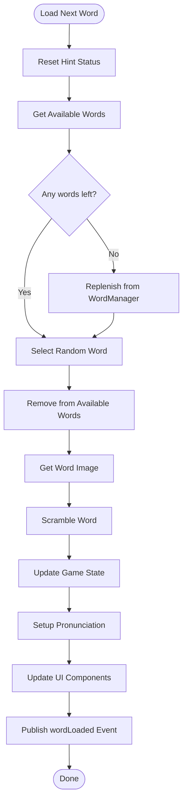
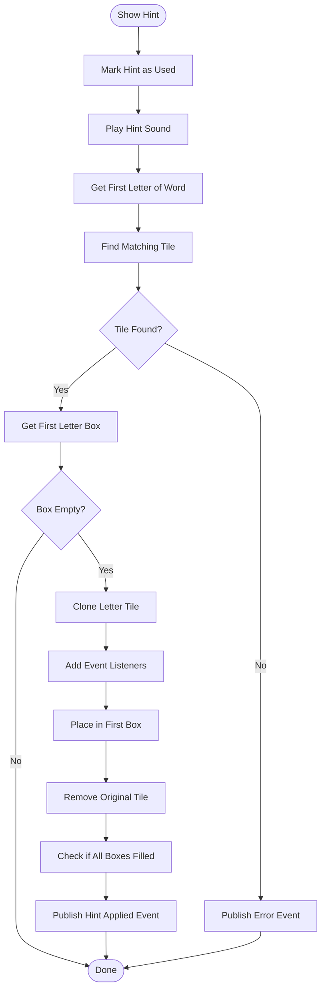

# WordController Module

The WordController module manages word selection, scrambling, and associated functionality in the Word Scramble Game. It serves as the core logic for word-related operations.

## Purpose and Functionality

The WordController module serves these key purposes:

1. **Word Selection**: Selects random words from the available word pool
2. **Word Scrambling**: Scrambles words using a consistent algorithm
3. **Letter Box Creation**: Creates UI elements for answers
4. **Hint System**: Provides hint functionality for players
5. **Word Loading**: Manages the complete word loading process

## Implementation Details

The WordController is implemented using the Module Pattern with event-driven communication:

```javascript
/**
 * Improved WordController Module for Word Scramble Game
 * Handles word management, loading, and scrambling with improved letter box creation
 */
const WordController = (function() {
    // Private state
    let _elements = {
        dropArea: null,
        scrambledWordElement: null
    };
    
    // Private methods
    
    /**
     * Scramble a word using Fisher-Yates shuffle
     * @param {string} word - Word to scramble
     * @returns {string} Scrambled word
     */
    function _scrambleWord(word) {
        const wordArray = word.split('');
        
        // Fisher-Yates shuffle
        for (let i = wordArray.length - 1; i > 0; i--) {
            const j = Math.floor(Math.random() * (i + 1));
            [wordArray[i], wordArray[j]] = [wordArray[j], wordArray[i]];
        }
        
        let scrambled = wordArray.join('');
        
        // If scrambled word is the same as original, try again
        if (scrambled === word && word.length > 1) {
            return _scrambleWord(word);
        }
        
        return scrambled;
    }
    
    /**
     * Display the scrambled word in the UI with improved tile creation
     * @param {string} scrambledWord - The scrambled word to display
     */
    function _displayScrambledWord(scrambledWord) {
        if (!_elements.scrambledWordElement) {
            console.error('Scrambled word element not found');
            return;
        }
        
        // Clear existing content
        _elements.scrambledWordElement.innerHTML = '';
        
        // Ensure DragDropManager is available
        if (!window.DragDropManager) {
            console.error('DragDropManager not found or not initialized');
            return;
        }
        
        // Create letter tiles for each character
        for (let i = 0; i < scrambledWord.length; i++) {
            const letter = scrambledWord[i];
            
            // Create a letter tile
            let letterTile = window.UIFactory.createLetterTile(
                letter,
                window.DragDropManager.dragStart.bind(window.DragDropManager),
                window.DragDropManager.dragEnd.bind(window.DragDropManager)
            );
            
            // Add to scrambled word area
            _elements.scrambledWordElement.appendChild(letterTile);
        }
    }
    
    /**
     * Create letter boxes in the drop area with improved positioning
     * @param {string} word - The current word
     */
    function _createLetterBoxes(word) {
        if (!_elements.dropArea) {
            console.error('Drop area element not found');
            return;
        }
        
        // Clear existing content
        _elements.dropArea.innerHTML = '';
        
        // Get the callbacks for letter boxes
        let dropCallbacks = null;
        if (window.DragDropManager && typeof window.DragDropManager.getLetterBoxCallbacks === 'function') {
            dropCallbacks = window.DragDropManager.getLetterBoxCallbacks(() => {
                if (window.EventBus) {
                    window.EventBus.publish('allLettersPlaced', null);
                }
            });
        }
        
        // Create a letter box for each character
        for (let i = 0; i < word.length; i++) {
            // Create letter box
            const letterBox = window.UIFactory.createLetterBox(
                i,
                dropCallbacks
            );
            
            _elements.dropArea.appendChild(letterBox);
        }
    }
    
    /**
     * Display word image
     * @param {string} imageUrl - Image URL for the word
     * @param {string} word - The current word for alt text
     */
    function _displayWordImage(imageUrl, word) {
        const wordImageElement = document.getElementById('word-image');
        if (!wordImageElement) return;
        
        if (imageUrl) {
            wordImageElement.src = imageUrl;
            wordImageElement.alt = word;
            wordImageElement.style.display = 'block';
        } else {
            // Use a placeholder or generated image
            const placeholderUrl = `https://source.unsplash.com/300x200/?${encodeURIComponent(word)}`;
            wordImageElement.src = placeholderUrl;
            wordImageElement.alt = word;
            wordImageElement.style.display = 'block';
        }
    }
    
    /**
     * Load the next word
     * @returns {boolean} Success status
     */
    function _loadNextWord() {
        try {
            // Safety check for GameState
            if (!window.GameState || typeof window.GameState.getState !== 'function') {
                console.error('GameState not properly initialized');
                return false;
            }
            
            // Reset hint status
            window.GameState.update({
                hintUsed: false
            });
            
            const gameState = window.GameState.getState();
            
            // Get available words
            let availableWords = gameState.availableWords || [];
            
            // If no words available, get words from Word Manager
            if (availableWords.length === 0) {
                if (window.WordManager && typeof window.WordManager.getWords === 'function') {
                    availableWords = window.WordManager.getWords();
                } else {
                    console.warn('WordManager not properly initialized, using fallback words');
                }
                
                // Fallback to default words if still no words available
                if (!availableWords || availableWords.length === 0) {
                    if (window.GameConfig && typeof window.GameConfig.get === 'function') {
                        availableWords = window.GameConfig.get('defaultWords');
                    } else {
                        // Hard-coded fallback if GameConfig is not available
                        availableWords = [
                            'apple', 'banana', 'cat', 'dog', 'elephant', 
                            'flower', 'garden', 'house', 'ice', 'jungle'
                        ];
                    }
                    console.log('Using fallback words');
                }
                
                // Update available words in state
                window.GameState.update({
                    availableWords
                });
            }
            
            // Choose a random word
            const randomIndex = Math.floor(Math.random() * availableWords.length);
            const currentWord = availableWords[randomIndex];
            
            // Remove word from available words
            const updatedWords = [...availableWords];
            updatedWords.splice(randomIndex, 1);
            
            // Get image URL for word
            let currentImageUrl = null;
            if (window.WordManager && typeof window.WordManager.getWordImage === 'function') {
                currentImageUrl = window.WordManager.getWordImage(currentWord);
            }
            
            // Scramble the word
            const scrambledWord = _scrambleWord(currentWord);
            
            // Update state
            window.GameState.update({
                currentWord,
                scrambledWord,
                currentImageUrl,
                availableWords: updatedWords
            });
            
            // Set up pronunciation
            if (window.AudioService && typeof window.AudioService.setupPronunciation === 'function') {
                window.AudioService.setupPronunciation(currentWord);
            }
            
            // Display word image
            _displayWordImage(currentImageUrl, currentWord);
            
            // Create letter boxes in drop area
            _createLetterBoxes(currentWord);
            
            // Display scrambled word
            _displayScrambledWord(scrambledWord);
            
            // Reset check button
            const checkBtn = document.getElementById('check-btn');
            if (checkBtn) {
                checkBtn.disabled = false;
            }
            
            // Publish event for new word loaded
            if (window.EventBus && typeof window.EventBus.publish === 'function') {
                window.EventBus.publish('wordLoaded', {
                    word: currentWord,
                    scrambled: scrambledWord
                });
            }
            
            return true;
        } catch (error) {
            console.error('Error loading next word:', error);
            
            // Fallback to a simple word in case of error
            const currentWord = 'apple';
            const scrambledWord = 'pplea';
            
            if (window.GameState && typeof window.GameState.update === 'function') {
                window.GameState.update({
                    currentWord,
                    scrambledWord
                });
            }
            
            // Create letter boxes and display fallback word
            _createLetterBoxes(currentWord);
            _displayScrambledWord(scrambledWord);
            
            // Publish error event
            if (window.EventBus && typeof window.EventBus.publish === 'function') {
                window.EventBus.publish('wordLoadError', {
                    error,
                    fallbackWord: currentWord
                });
            }
            
            return false;
        }
    }
    
    /**
     * Show a hint (first letter)
     * @returns {boolean} Success status
     */
    function _showHint() {
        try {
            // Safety check for GameState
            if (!window.GameState || typeof window.GameState.update !== 'function') {
                console.error('GameState not properly initialized');
                return false;
            }
            
            // Mark hint as used
            window.GameState.update({
                hintUsed: true
            });
            
            // Play hint sound
            if (window.AudioService && typeof window.AudioService.playSound === 'function') {
                window.AudioService.playSound('hint');
            }
            
            const gameState = window.GameState.getState();
            
            // Find the first letter of the current word
            const firstLetter = gameState.currentWord.charAt(0);
            
            // Find matching letter in the scrambled word area
            const scrambledWordElement = document.getElementById('scrambled-word');
            if (!scrambledWordElement) {
                console.error('Scrambled word element not found');
                return false;
            }
            
            const letterTiles = scrambledWordElement.querySelectorAll('.letter-tile');
            let matchingTile = null;
            
            for (const tile of letterTiles) {
                if (tile.textContent.toLowerCase() === firstLetter.toLowerCase()) {
                    matchingTile = tile;
                    break;
                }
            }
            
            if (matchingTile) {
                // Get the first letter box
                const firstLetterBox = _elements.dropArea.querySelector('.letter-box[data-position="0"]');
                
                // If first letter box is empty
                if (firstLetterBox && !firstLetterBox.querySelector('.letter-tile')) {
                    // Clone the matching tile
                    const clone = matchingTile.cloneNode(true);
                    
                    // Add event listeners to the clone
                    if (window.DragDropManager) {
                        clone.addEventListener('dragstart', window.DragDropManager.dragStart.bind(window.DragDropManager));
                        clone.addEventListener('dragend', window.DragDropManager.dragEnd.bind(window.DragDropManager));
                    }
                    
                    // Add to first letter box
                    firstLetterBox.appendChild(clone);
                    
                    // Remove original tile
                    matchingTile.remove();
                    
                    // Check if answer is now complete
                    const allBoxesFilled = _elements.dropArea.querySelectorAll('.letter-box:empty').length === 0;
                    if (allBoxesFilled && window.EventBus) {
                        setTimeout(() => {
                            window.EventBus.publish('allLettersPlaced', null);
                        }, 100);
                    }
                    
                    // Publish hint applied event
                    if (window.EventBus) {
                        window.EventBus.publish('hintApplied', {
                            letter: firstLetter,
                            position: 0
                        });
                    }
                    
                    return true;
                }
            }
            
            return false;
        } catch (error) {
            console.error('Error showing hint:', error);
            
            // Publish error event
            if (window.EventBus && typeof window.EventBus.publish === 'function') {
                window.EventBus.publish('hintError', {
                    error
                });
            }
            
            return false;
        }
    }
    
    // Public API
    return {
        /**
         * Initialize word controller
         * @returns {Object} WordController for chaining
         */
        init: function() {
            // Get DOM elements
            _elements = {
                dropArea: document.getElementById('drop-area'),
                scrambledWordElement: document.getElementById('scrambled-word')
            };
            
            if (!_elements.dropArea) {
                console.error('Drop area element not found during initialization');
            }
            
            if (!_elements.scrambledWordElement) {
                console.error('Scrambled word element not found during initialization');
            }
            
            // Subscribe to events if EventBus is available
            if (window.EventBus && typeof window.EventBus.subscribe === 'function') {
                window.EventBus.subscribe('hintButtonClicked', () => {
                    this.showHint();
                });
                
                window.EventBus.subscribe('nextButtonClicked', () => {
                    this.loadNextWord();
                });
                
                // Subscribe to state changes related to words
                window.EventBus.subscribe('stateChanged', (data) => {
                    if (data && data.changes && data.changes.scrambledWord) {
                        _displayScrambledWord(data.changes.scrambledWord.newValue);
                    }
                });
            } else {
                console.warn('EventBus not available, button events will not work');
            }
            
            return this;
        },
        
        /**
         * Load next word (exposed for external access)
         * @returns {boolean} Success status
         */
        loadNextWord: function() {
            return _loadNextWord();
        },
        
        /**
         * Show hint (exposed for external access)
         * @returns {boolean} Success status
         */
        showHint: function() {
            return _showHint();
        },
        
        /**
         * Get scrambled version of a word
         * @param {string} word - Word to scramble
         * @returns {string} Scrambled word
         */
        getScrambledWord: function(word) {
            return _scrambleWord(word);
        },
        
        /**
         * Create letter boxes for a word
         * @param {string} word - Word to create letter boxes for
         */
        createLetterBoxesForWord: function(word) {
            _createLetterBoxes(word);
        },
        
        /**
         * Display scrambled version of a word
         * @param {string} scrambledWord - Scrambled word to display
         */
        displayScrambledWord: function(scrambledWord) {
            _displayScrambledWord(scrambledWord);
        }
    };
})();

// Subscribe to pronunciation button clicks
window.EventBus.subscribe('pronounceButtonClicked', () => {
    // Call the pronounceWord method from AudioService
    if (window.AudioService && typeof window.AudioService.pronounceWord === 'function') {
        window.AudioService.pronounceWord();
    }
});

// Export the module
window.WordController = WordController;
```

## Key Functions

The module exposes several public functions:

### init()

Initializes the word controller, setting up event subscriptions and DOM references.

**Returns**: The WordController object for method chaining

**Example**:
```javascript
// Initialize the word controller
WordController.init();
```

### loadNextWord()

Loads the next random word from the available words pool.

**Returns**: boolean - Whether the word loading was successful

**Example**:
```javascript
// Load the next word
WordController.loadNextWord();
```

### showHint()

Shows a hint by revealing the first letter of the current word.

**Returns**: boolean - Whether the hint was successfully shown

**Example**:
```javascript
// Show a hint to the user
WordController.showHint();
```

### getScrambledWord(word)

Returns a scrambled version of a given word using the Fisher-Yates shuffle algorithm.

**Parameters**:
- `word` (string): The word to scramble

**Returns**: string - The scrambled word

**Example**:
```javascript
// Get a scrambled version of "banana"
const scrambled = WordController.getScrambledWord("banana");
```

### createLetterBoxesForWord(word)

Creates letter boxes in the drop area for the given word.

**Parameters**:
- `word` (string): The word to create letter boxes for

**Example**:
```javascript
// Create letter boxes for "apple"
WordController.createLetterBoxesForWord("apple");
```

### displayScrambledWord(scrambledWord)

Displays a scrambled word as draggable letter tiles.

**Parameters**:
- `scrambledWord` (string): The scrambled word to display

**Example**:
```javascript
// Display the scrambled word "pplea"
WordController.displayScrambledWord("pplea");
```

## Event Subscriptions

The WordController subscribes to these events:

| Event | Action |
|-------|--------|
| `hintButtonClicked` | Shows a hint to the user |
| `nextButtonClicked` | Loads the next word |
| `stateChanged` | Updates UI if the scrambled word changes |

## Published Events

The WordController publishes these events:

| Event | Description | Data |
|-------|-------------|------|
| `wordLoaded` | A new word has been loaded | `{word, scrambled}` |
| `wordLoadError` | Error loading a word | `{error, fallbackWord}` |
| `hintApplied` | A hint has been applied | `{letter, position}` |
| `hintError` | Error showing a hint | `{error}` |

## Word Scrambling Algorithm

The module uses the Fisher-Yates shuffle algorithm to scramble words:

```javascript
function _scrambleWord(word) {
    const wordArray = word.split('');
    
    // Fisher-Yates shuffle
    for (let i = wordArray.length - 1; i > 0; i--) {
        const j = Math.floor(Math.random() * (i + 1));
        [wordArray[i], wordArray[j]] = [wordArray[j], wordArray[i]];
    }
    
    let scrambled = wordArray.join('');
    
    // If scrambled word is the same as original, try again
    if (scrambled === word && word.length > 1) {
        return _scrambleWord(word);
    }
    
    return scrambled;
}
```

This algorithm has these properties:
- O(n) time complexity where n is the word length
- Provides an unbiased, random permutation
- Guarantees that the scrambled word differs from the original (recursive check)

## Word Loading Process

The word loading process follows these steps:

1. **Reset Hint Status**: Mark that no hint has been used for the new word
2. **Get Available Words**: Retrieve available words from GameState or WordManager
3. **Select Random Word**: Choose a random word from the available pool
4. **Remove Selected Word**: Remove the selected word from the available pool
5. **Get Word Image**: Fetch the image URL for the selected word
6. **Scramble Word**: Create a scrambled version of the word
7. **Update State**: Update the game state with the new word information
8. **Setup Pronunciation**: Configure text-to-speech for the new word
9. **Update UI**: Create letter boxes and display the scrambled word
10. **Publish Event**: Notify the system that a new word has been loaded



## Hint System Implementation

The hint system reveals the first letter of the current word:

1. **Mark Hint Used**: Update the game state to record hint usage
2. **Play Sound**: Play the hint sound effect
3. **Find First Letter**: Get the first letter of the current word
4. **Find Matching Tile**: Locate a tile with the first letter in the scrambled word area
5. **Get First Letter Box**: Find the first letter box in the drop area
6. **Create Clone**: Clone the found letter tile
7. **Place Clone**: Place the clone in the first letter box
8. **Remove Original**: Remove the original tile from the scrambled word area
9. **Check Completeness**: Check if all letter boxes are now filled
10. **Publish Event**: Notify the system that a hint has been applied



## UI Interaction

The WordController interacts with the UI through these components:

### Letter Boxes

```javascript
function _createLetterBoxes(word) {
    // Clear drop area
    _elements.dropArea.innerHTML = '';
    
    // Create a letter box for each character
    for (let i = 0; i < word.length; i++) {
        // Create letter box using the UI Factory
        const letterBox = window.UIFactory.createLetterBox(
            i,
            // Get callbacks from DragDropManager
            window.DragDropManager.getLetterBoxCallbacks(() => {
                // Callback when all boxes are filled
                window.EventBus.publish('allLettersPlaced', null);
            })
        );
        
        _elements.dropArea.appendChild(letterBox);
    }
}
```

### Letter Tiles

```javascript
function _displayScrambledWord(scrambledWord) {
    // Clear scrambled word area
    _elements.scrambledWordElement.innerHTML = '';
    
    // Create letter tiles for each character
    for (let i = 0; i < scrambledWord.length; i++) {
        const letter = scrambledWord[i];
        
        // Create a letter tile using the UI Factory
        const letterTile = window.UIFactory.createLetterTile(
            letter,
            window.DragDropManager.dragStart,
            window.DragDropManager.dragEnd
        );
        
        // Add to scrambled word area
        _elements.scrambledWordElement.appendChild(letterTile);
    }
}
```

## Integration with Other Modules

The WordController integrates with:

1. **GameState**: Stores and retrieves word-related state
2. **EventBus**: Publishes and subscribes to events
3. **WordManager**: Gets words and associated images
4. **AudioService**: Sets up pronunciation and plays sounds
5. **UIFactory**: Creates letter boxes and tiles
6. **DragDropManager**: Provides drag and drop functionality

## Error Handling

The module includes comprehensive error handling:

```javascript
try {
    // Word loading logic
} catch (error) {
    console.error('Error loading next word:', error);
    
    // Fallback to a simple word
    const currentWord = 'apple';
    const scrambledWord = 'pplea';
    
    if (window.GameState) {
        window.GameState.update({
            currentWord,
            scrambledWord
        });
    }
    
    // Basic UI updates with fallback word
    _createLetterBoxes(currentWord);
    _displayScrambledWord(scrambledWord);
    
    // Publish error event
    if (window.EventBus) {
        window.EventBus.publish('wordLoadError', {
            error,
            fallbackWord: currentWord
        });
    }
    
    return false;
}
```

## Usage Patterns

### Basic Usage

```javascript
// Initialize the word controller
WordController.init();

// Load the first word
WordController.loadNextWord();

// Show a hint when the hint button is clicked
document.getElementById('hint-btn').addEventListener('click', function() {
    WordController.showHint();
});
```

### Responding to Word Events

```javascript
// Subscribe to word loaded events
EventBus.subscribe('wordLoaded', function(data) {
    console.log('New word loaded:', data.word);
    console.log('Scrambled version:', data.scrambled);
    
    // Update UI or other components
    updateWordDisplay(data.scrambled);
});
```

### Custom Word Scrambling

```javascript
// Test the scrambling algorithm
function testScrambling() {
    const words = ['apple', 'banana', 'elephant', 'house'];
    
    words.forEach(word => {
        const scrambled = WordController.getScrambledWord(word);
        console.log(`${word} → ${scrambled}`);
    });
}
```

## Best Practices

When working with the WordController module, follow these best practices:

### 1. Event-Based Communication

Use events for communication rather than direct method calls:

```javascript
// Good: Use events
document.getElementById('hint-btn').addEventListener('click', function() {
    EventBus.publish('hintButtonClicked', null);
});

// Bad: Direct method call bypassing the event system
document.getElementById('hint-btn').addEventListener('click', function() {
    WordController.showHint();
});
```

### 2. State Management

Use GameState for storing word-related state:

```javascript
// Good: Update through GameState
function updateCurrentWord(word, scrambled) {
    GameState.update({
        currentWord: word,
        scrambledWord: scrambled
    });
}

// Bad: Store state in module variables
let currentWord = '';
let scrambledWord = '';

function updateCurrentWord(word, scrambled) {
    currentWord = word;
    scrambledWord = scrambled;
}
```

### 3. Error Handling

Always handle errors gracefully:

```javascript
// Good: Try/catch with fallback
try {
    loadNextWord();
} catch (error) {
    console.error('Error loading word:', error);
    loadFallbackWord();
}

// Bad: No error handling
loadNextWord();
```

## Conclusion

The WordController module is a central component of the Word Scramble Game, managing word selection, scrambling, and related functionality. Its event-driven architecture and integration with other modules allow it to handle the core game mechanics while maintaining separation of concerns.

The module's robust error handling ensures the game can continue functioning even when problems occur, while its clean API provides a simple interface for other components to interact with word-related functionality.